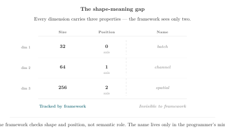
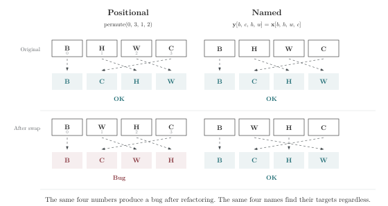

# Chapter 1 · The Ghost in the Name

*Primitives · Naming and permutation*

---

Here is a story about a bug.

It is not a dramatic bug. It produces no stack trace, no NaN cascade, no `CUDA error: device-side assert triggered`. It does not crash the training run. It does not even make the loss go up.

It is worse than all of those things. It makes the loss go down, smoothly and convincingly, while the program learns the wrong thing.

The tensor has shape `(32, 64, 256)`. A human being—the one who wrote the data loader—knows that these three dimensions are `batch`, `channel`, and `spatial`. The human wrote a comment. The human chose a variable name: `spatial_features`. The human did everything a responsible programmer does.

Then the human wrote:

```python
x = x.mean(dim=1)
```

`dim=1` erases a dimension. Which dimension? At the time of writing, position 1 held `channel`. The operation's *intent* was "average over channels." But the operation's *text* says nothing about channels. It says `dim=1`. A position. A number.

Three months pass. Another human—or the same human, after enough context has drained from memory—refactors the data pipeline. Channel moves to position 2. The new shape is `(32, 256, 64)`. `mean(dim=1)` now silently erases `spatial`.

Shape check: pass. Type check: pass. Unit tests: pass. Integration tests: pass. The loss descends. The eval metrics look normal. The model deployed on Tuesday. The customer complaint arrived on Thursday.

This bug lived for three weeks because **the notation had no slot for the fact that would have caught it.** The fact—"I am erasing `channel`, not `spatial`"—was present in a comment, in a variable name, in the author's mental model. It was absent from the one place the compiler could see: the source text of the operation itself.

Positional notation is not *wrong*. It is *insufficient*. It records the arithmetic of shapes. It does not record the identity of coordinates. When those two things diverge—when a shape is correct but a coordinate is wrong—positional notation gives you no place to notice.

This book is about closing that gap.

---

### How the Bug Lived: A Timeline

Let's trace the life of this bug, day by day. Not to dramatize it—the drama is already there, buried under three weeks of normal-looking training runs. We trace it to understand one thing: at every single point along this timeline, the notation had an opportunity to catch the bug. At every single point, it lacked the information to do so.

**Day 0.** The data loader is written. Output shape: `(32, 64, 256)`. The author writes a comment: `# dims: (batch, channel, spatial)`. The author writes the model: `x = x.mean(dim=1)`. The comment says `channel`. The code says `dim=1`. The author knows they refer to the same thing. The compiler does not.

**Day 90.** A colleague refactors the data pipeline. The new preprocessing step produces `(32, 256, 64)`—batch, spatial, channel. The colleague updates the data loader comment: `# dims: (batch, spatial, channel)`. The colleague does not read every model file. The model still says `mean(dim=1)`. Shape check: `(32, 256, 64).mean(dim=1)` → output shape `(32, 64)`. No error. No warning. `dim=1` still means position 1. Position 1 is now `spatial`. The operation that used to mean "average over channels" now means "average over spatial positions."

**Day 97.** The model is deployed to staging. Integration tests pass—they check output shapes, not output semantics. The loss descends. The eval metrics look reasonable because the model has learned to compensate for the loss of spatial information by overfitting to batch-level patterns. It's not obviously broken—it's subtly, systematically wrong in a way that takes expertise to detect.

**Day 99.** A customer reports that the model's predictions are "occasionally nonsensical on spatially asymmetric inputs." The report sits in a queue. It could be anything—a data issue, a training instability, a fluke.

**Day 100.** 3 AM. An engineer—the same one who wrote the original data loader, or perhaps a new one who never saw the original comment—traces one number backward through twelve layers. The engineer notices that spatial information is being averaged away in the first operation. The engineer stares at `mean(dim=1)`. The engineer remembers: three months ago, channel was at position 1. The engineer checks the data loader comment. Channel moved. `dim=1` didn't.

The engineer fixes the bug in one line. `mean(dim=1)` becomes `mean(dim=2)`. The fix takes ten seconds. The debugging took three hours.

Now ask yourself: at which point in this timeline **should** the bug have been caught?

Day 0, when the comment was written? The comment had the information. The code couldn't read it.

Day 90, when the data pipeline was refactored? The refactoring changed what `dim=1` referred to. Nothing in the toolchain connected the refactoring to the operations that depended on it. A human being would have had to notice, manually, while reading diffs across multiple files.

Day 97, when the model was deployed? The integration tests checked shapes, not identities. Shapes are cheap to check; identities require naming the coordinates.

Day 100, at 3 AM? That's when it *was* caught. By a human being, with context, tracing numbers backward through layers. The most expensive moment on the timeline to catch a bug—and the only one where the bug was visible at all.

Every earlier point on the timeline is a missed opportunity. Not because the programmers were careless. Because the notation gave them nothing to work with. `dim=1` carries no information about what dimension 1 *is*. When dimension 1 changed, `dim=1` changed its meaning silently. The operation text didn't change. The compiler didn't complain. The tests passed. The loss went down.

The bug survived not because no one looked. It survived because the notation recorded position and only position. Identity was elsewhere—in a comment that drifted, in a variable name that wasn't checked, in a mental model that eroded over 90 days.

---

But before we go there—stop for a moment. Think about your own code.

What is the hardest-to-debug tensor shape bug you have ever written? Not a crash, not a NaN—those are easy. A bug where everything ran, the loss went down, the metrics looked fine, and yet the program was systematically, invisibly wrong. Was there a time when `axis=-1` or `dim=1` made you think you were erasing `channel`, but you were actually erasing `spatial`? What finally helped you find it?

Take a moment. Remember what that felt like.

Now ask yourself a harder question: what did you feel when you finally found it?

Not relief. Or not *just* relief. Most engineers, asked this question, describe something closer to anger. Not at themselves. At the situation. At the fact that they spent three hours, or three days, tracing a bug that should have been caught the moment it was introduced. At the fact that the toolchain—the compiler, the type checker, the test suite, the linter, the code review—let this bug through, because none of them had a slot for the information that would have caught it.

"That information was in my head the whole time," the engineer thinks. "I knew `dim=1` was channel. I wrote it in a comment. Why didn't the compiler read the comment?"

The compiler didn't read the comment because comments are not checked. The compiler checked the shapes—`(32, 64, 256).mean(dim=1)` is valid, always, regardless of what dimension 1 represents. The compiler checked the types—`mean` returns a float tensor, always. The compiler could not check that `dim=1` was channel, because the compiler had no word for channel.

This is not a compiler failure. It is a notation failure. The notation gave the compiler nothing to check. `dim=1` encodes a *where*. The information that matters—the *what*—was never written in a form the compiler could see.

This book is about writing the *what* in a form the compiler can see. And the form is simpler than you think. It is a name, in a bracket, next to the operation. That's it. Five characters—`class`, `batch`, `channel`—and the compiler has something to check. The rest of the book is about what happens when you take that seriously.

---

The problem with `dim=1` is not that you wrote it wrong. The problem is that `dim=1` records nothing about your intent. When you wrote `dim=1`, you meant "erase the channel dimension." But `dim=1` doesn't say that. It says "erase dimension at position 1." And position 1 is not a fact about the data. It is a fact about the current layout—a layout that can change without the operation knowing.

Now imagine writing it differently:

```rust
let y[b, s] = mean[channel](x[b, channel, s]);
```

The bracket after `mean` names `channel`—not a position, but an identity. If upstream changes the dimension order, `channel` is still `channel`. If `x` doesn't have a `channel` coordinate, it is caught before a single value is computed. Not during debugging. Not during code review. At the moment the code is written, when the fix costs seconds instead of weeks.

This is the core claim of this book: **when coordinate names appear in the syntax, the notation itself becomes a form of static verification.** The same line that tells the reader what you meant also tells the machine what to check. There is no separate channel of documentation that can drift out of sync—because the documentation *is* the check, and the check *is* the code.

Every chapter that follows is one step deeper into this claim. By the end, you will not just understand why names matter—you will have watched them be checked, transformed, and burned into the integers that actually execute. And when you return to your own code, you will read `x.mean(dim=1)` differently. The gap will still be there. But you will see it.

---

## What Is a Tensor?

Ask a framework documentation and it will tell you: a multidimensional array. Ask a tensor's `.shape` attribute and it will tell you: `(32, 64, 256)`. Ask a compiler and it will tell you: a pointer to a contiguous block of memory with strides and a dtype.

All true. All missing the point.

A tensor is a function from coordinates to values. You give it a `batch` index, a `channel` index, and a `spatial` index; it gives you back a number. The three coordinates together form an address. Every element in the tensor lives at exactly one address.

This definition is not exotic. It is how mathematicians have written tensor operations for a century:

$$C_{ij} = \sum_k A_{ik} B_{kj}$$

The letters `i`, `j`, and `k` are not axis numbers. They are coordinate names. `i` walks the rows of `A`. `j` walks the columns of `B`. `k` walks the dimension they share—the one that gets summed away. You can rename `i` to `row`, `j` to `col`, `k` to `inner`, and the mathematics is unchanged.

Now look at how we write the same operation in a modern framework:

```python
C = torch.matmul(A, B)
```

Where are `i`, `j`, and `k`? They are gone. The names that gave the operation its meaning are not present in the source text. The compiler knows the shapes of `A` and `B`. It checks that the inner dimensions agree. It does not know—cannot know—that `A`'s second axis represents `feature` and not `time`, or that `B`'s first axis represents `feature` and not `vocab_size`. It only knows that both are `64`.

---

A coordinate has three properties. The framework records two of them. The third—the name—exists only in the programmer's head, in comments, or in variable naming conventions.



This is the shape-meanings gap. The shape says *how many*. The role says *which one*. Every framework knows the shape. None of them know the role.

Now imagine a different notation:

```rust
let y[b, s] = mean[channel](x[b, channel, s]);
```

The bracket after `mean` names the coordinate being **consumed**—eliminated from the output, its values collapsed into a single number. The brackets after `y` and `x` name the coordinates that survive. That `channel` exists on `x` is statically checked. The reader sees the consumption without reconstructing it. The fact that was previously in a comment—"average over channels"—is now in the syntax, where it can be enforced and the reader can audit it.

Now consider the reverse situation. Instead of eliminating a coordinate, suppose a value needs to be copied *along* one:

```rust
let out[b, c, s] = x[b, c, s] + bias[c];
```

`bias` is indexed only by `c`. It has no `b` and no `s` in its brackets. The absence declares: `bias` is silent on `b` and `s`. Its value is copied across every batch element and every spatial position. Not because broadcasting is a convenient default. Because the indexing pattern makes a semantic claim—`bias` does not depend on the batch or the spatial coordinate—and that claim is honored.

Think of a tensor as a person holding a **repeater** (a megaphone). `bias[c]` speaks on coordinate `c`: at `c=0` it says one value, at `c=1` another. On every coordinate not in its brackets—`b`, `s`—it says nothing. Silence. The notation, encountering this silence in the indexing pattern, fills it by repeating the value. The repetition is not a convenience feature. It is the notation honoring the promise that `bias` made by omitting those coordinates: "my value is independent of `b` and `s`. Ask me a thousand times with different `b`, and I give the same answer."

This is the megaphone model: a tensor speaks on the coordinates in its brackets, and stays silent on all others. Broadcasting is repeating the silent message wherever it is asked. Reduction is the inverse—pointing the megaphone at a coordinate and speaking it out of existence.

A coordinate has three properties. First, a **name**: `batch`, `channel`, `time`, `feature`. The name carries the semantic role. Second, a **domain**: the set of values the coordinate can take. For a tensor of shape `(32, 64, 256)`, the `batch` coordinate ranges from `0` to `31`, `channel` from `0` to `63`, and `spatial` from `0` to `255`. Third, a **position**: where this coordinate sits in the tensor's shape tuple. In `(32, 64, 256)`, `batch` is at position 0, `channel` at position 1, `spatial` at position 2.

Positional notation records only the domain and the position—`(32, 64, 256)` tells you the sizes and their order, but not their names. Named notation records all three: `[batch: 32, channel: 64, spatial: 256]`.

When you write `x.mean(dim=1)`, you are asking the position to stand in for the name. It works until the position changes. When you write `mean[channel](x)`, you are using the name directly. The position becomes an implementation detail—the compiler's problem, not yours.

---

## An Analogy: The Parking Lot

You park your car in Row D, Slot 7. The ticket in your pocket says "D-7." You return after dinner to find the lot has been repainted. The rows now run perpendicular to their old orientation. Row D is now somewhere else entirely. Your ticket, which records a *position* in a fixed coordinate system, sends you to the wrong car.

The lot's *shape* hasn't changed. It is still an 8 × 20 grid. A shape checker would tell you everything is fine. But the *role* of each row—which row is "D"—has moved.

This is what happens when you write `x.transpose(1, 2)`. The shape is still `(32, 256, 64)`. A shape checker sees the same three numbers. But the positions have been reassigned. Dimension 1 is no longer `channel`. Dimension 2 is no longer `spatial`. The ticket in your pocket—`dim=1`—now points to the wrong car.

A named-coordinate notation is like a ticket that says "the blue Honda Civic" instead of "D-7." The car may move, but the description finds it.

Now extend this analogy. Imagine the parking lot has three underground levels—B1, B2, B3—each an 8×20 grid. Your ticket says "D-7-B1": row D, slot 7, basement level 1. You return to find the lot has been renovated. The levels have been renumbered—B1 is now B3. The rows on each level have been rotated 90 degrees. Slot numbers run in the opposite direction. Your ticket now points to a space that doesn't exist, or worse, to someone else's car.

A shape checker would tell you the lot still has three levels of 8×20. Correct. The shape is the same. A position checker would tell you "D-7-B1" is a valid coordinate in the new system—it's just a *different* space. Also correct. Neither checker can tell you that your ticket describes the wrong space, because neither checker knows which space is yours.

This is what happens when you write `x.permute(1, 2, 0)` on a tensor with shape `(32, 64, 256)`. The shape after permutation is `(64, 256, 32)`. A shape checker sees three numbers and approves. But which dimension is batch now? Which is channel? The shape doesn't tell you. The permutation numbers don't tell you. They tell you that dimension 1 moved to position 0, dimension 2 to position 1, dimension 0 to position 2. They don't tell you that `channel` moved to the front, that `spatial` is now in the middle, that `batch` is now last.

A named permutation tells you all of that:

```rust
let y[c, s, b] = x[b, c, s];
```

You don't need to decode `(1, 2, 0)`. You read `y[c, s, b]` and you know: channel first, then spatial, then batch. If the lot gets renovated—if the upstream tensor changes its internal order—the named permutation still finds your car, because it looks for the blue Honda Civic, not D-7-B1.

The 3D parking lot teaches something the 2D version couldn't: when you compose multiple layout changes—renumbering levels AND rotating rows AND reversing slots—the positional ticket becomes wrong in multiple independent ways. Each way must be diagnosed separately. The named ticket is right about all of them simultaneously, because it never depended on any of them to begin with.

---

## The Four Operations: A First Look

Every tensor computation is built from four primitive operations. You'll meet them properly in the chapters ahead. For now, here is what each one looks like in two notations—and what each notation records.

| Operation | PyTorch/NumPy | Einlang | What the name records |
|:---|:---|:---|:---|
| **Reduce** | `x.mean(dim=1)` | `mean[channel](x[b, c, s])` | Which coordinate is consumed |
| **Broadcast** | `x + bias[:, None, :]` | `x[b, c, s] + bias[c]` | Which coordinates bias is silent on |
| **Permute** | `x.permute(0, 3, 1, 2)` | `y[b, c, h, w] = x[b, h, w, c]` | Where each coordinate ends up |
| **Contract** | `torch.matmul(A, B)` | `sum[k](A[b, k] * B[k, f])` | Which coordinate is shared and consumed |

Look at the "What the name records" column. In every case, the name records a fact about identity. In the positional version, that fact is not recorded. It lives in the programmer's head.

Now imagine a refactoring changes the dimension order. In the PyTorch column, every row might need to change: `dim=1` might become `dim=2`, `[:, None, :]` might become `[None, :, :]`, `permute(0, 3, 1, 2)` might become `permute(0, 2, 3, 1)`, and the `matmul` might silently produce different results. In the Einlang column, no row changes. `channel` is still `channel`, regardless of its position. `bias` is still silent on `b` and `s`, regardless of where those coordinates sit. `h` still maps to `h`, wherever it appears in the input.

The positional column records *how*. The named column records *what*. The difference is whether a refactoring forces you to update every operation that touches the refactored tensor.

---

## Permutation: Moving Without Losing

A permutation changes the order of dimensions without changing any values. It is the simplest tensor operation there is—no arithmetic, no reduction, just relabeling positions.

It is also a reliable source of 11 PM debugging sessions.

The problem is not that permutation is hard. The problem is that positional permutation describes *mechanics* rather than *intent*. Here is a concrete example. An image-processing pipeline takes input in `(batch, height, width, channel)` and needs it in `(batch, channel, height, width)`:

```python
x = x.permute(0, 3, 1, 2)
```

The programmer writes this while looking at a diagram that says "channel moves from position 3 to position 1." The diagram is correct. The code is correct. Six months later, upstream changes its output convention to `(batch, width, height, channel)`. Height and width have swapped. `permute(0, 3, 1, 2)` still executes without complaint. Channel still ends up at position 1—correct. But height and width are now in positions the programmer did not intend. The shapes are identical. The values are wrong.

No shape checker catches this. No type checker catches this. The bug will surface in production as "the model is slightly worse on images with non-square aspect ratios," and it will take a human being several hours to trace the silent swap back to this one line.

The root cause: `(0, 3, 1, 2)` describes a rearrangement of *positions*. What the programmer needed to describe was a rearrangement of *identities*—"move the dimension called `channel` to the front, and keep everything else in order."

---



The figure tests both notations against a common refactoring. Top row: the original pipeline maps BHWC to BCHW. On the left, `permute(0,3,1,2)`—read "old axis 0 stays at 0, old axis 3 moves to 1, old axis 1 moves to 2, old axis 2 moves to 3"—produces the correct result. On the right, the named expression `y[b,c,h,w] = x[b,h,w,c]` produces the same correct result. Both pass. Bottom row: upstream swaps height and width, so the input is now BWHC. The positional instruction executes identically—`permute(0,3,1,2)` is still the same four numbers—but the output is now B,C,W,H. Height and width are silently exchanged. The named expression `y[b,c,h,w] = x[b,h,w,c]` adapts automatically: `h` maps to the second axis in the input regardless of where height landed, `w` maps to the third. The instruction did not change. The meaning did.

Einops addresses this with a string-based notation:

```python
y = rearrange(x, "batch height width channel -> batch channel height width")
```

This is better. The names survive renaming of upstream positions, because `rearrange` matches by name, not by index. But the string is still a string. The names `height` and `width` are not checked against any declaration. They are local to this one call. If the tensor actually contains `time` rather than `height`, the string won't catch it—it will happily treat `time` as if it were `height`, because the names in the string are just pattern variables, not coordinate declarations.

What we want is for the coordinate names to be **checked facts**, not comments embedded in syntax:

```rust
let y[b, c, h, w] = x[b, h, w, c];
```

This is an Einlang rectangular declaration. The left-hand side declares the output coordinates. The right-hand side indexes the input by those same coordinate names. `b` appears on both sides in the same position—it survives unchanged. `h` appears on the left at position 2 and on the right at position 1—it has been moved. Every coordinate on the right is checked to exist on `x`, and every coordinate on the left must appear somewhere on the right.

You don't need a `permute` function. You don't need a `rearrange` string. You just write where each coordinate goes, and the movement is inferred. The code says *what you want*, not *how to achieve it*.

This is a pattern that will recur through the entire book: **when coordinate names appear in the syntax, operations become self-documenting.** The same line of code that instructs the machine also informs the reader. There is no separate channel of documentation that can drift out of sync.

---

Positional permutation is not evil. It is the right abstraction for a compiler pass that only needs to know "move this stride to that position." But source code is not written for compilers. It is written for the human who will debug it at 11 PM, three months after the original author left the team. That human needs to know *what moved where and why*. Position numbers answer the first question, but not the second. Names answer both.

---

## What the Bug Teaches

The bug that opened this chapter was not special. It was not caused by negligence or inexperience. It was caused by a gap between what the programmer knew and what the notation could record. The programmer knew `dim=1` was `channel`. The notation recorded `1`.

Every bug in this book shares that structure. A fact exists in the programmer's head. The notation has no slot for it. The fact drifts. The code runs. The bug survives.

The coordinate habit is the discipline of putting the fact in the notation. When the notation has no slot—when you're writing PyTorch or JAX or NumPy—you create a slot: a comment, a naming convention, an einops string. When the notation has a slot—when you're writing Einlang—you fill it with a bracket and a name.

The slot is not the point. The name is not the point. The point is that the fact, once recorded, can be checked. A fact in a comment can rot. A fact in a bracket is verified at every call site. The distance between the two is the distance between hope and guarantee.

Let's say that again, because it is the most important paragraph in this chapter. A fact in a comment is a hope—"I hope the next programmer reads this, I hope the refactoring tool updates it, I hope it's still true." A fact in a bracket is a guarantee—"the compiler checked this at the call site, three milliseconds ago, and if it were false, the code would not compile." The difference between hope and guarantee is the difference between a bug that survives three weeks and a bug that can't survive the first save.

Now, a question. You have probably already thought it: "Can't I just be careful about `dim=1`? Can't I just remember which dimension is which?"

You can. You have. For entire projects, you have held the dimension layout in your head—batch is 0, channel is 1, height is 2, width is 3. You have written `dim=1` everywhere and it has worked, because you were careful and the layout didn't change.

This book is not arguing that positional notation is impossible to use correctly. It is arguing that it is impossible to **verify** correctly—not by a human holding context in their head, but by a tool that checks the code mechanically, every time, without fatigue, without forgetting, without leaving the team.

The question is not "can you be careful?" The question is "should the compiler help?"

Every engineer who has debugged a `dim=1` bug at 3 AM knows the answer to that question. The compiler should help. But the compiler can only help if the code contains information it can check. `dim=1` contains nothing checkable about identity—it is always a valid integer. `channel`, written in a bracket next to the operation, is checkable: does this tensor have a coordinate called `channel`? Yes or no. The compiler can answer that question. And from that single yes-or-no question, an entire class of bugs becomes impossible.

This is the pattern that will recur through every chapter of this book. At each step, we will find operations that work by position—and ask: what if they worked by name instead? What would the compiler be able to check? What bugs would become impossible? The answers accumulate. By the end, you will have a working compiler that checks five rules—rules that positional notation cannot even ask, because it lacks the words to ask them.

You now know what a coordinate is: a name, a domain, a position. You know that naming the coordinate makes it survive position changes. You know that the parking lot ticket with the name of the car survives the repainting.

The rest of this book is about what happens when you take that knowledge seriously—when you require every reduction to name the coordinate it consumes, every broadcast to be visible by omission, every function to declare which coordinates it operates on. The result is not a new way of writing tensor code. It is a new way of reading it: with the expectation that the code tells you what it means, not just how it runs.

---

### Stop and Think

Before you turn the page, do this once. It will take five minutes. It may change how you read tensor code for the rest of your career.

Open your most recent tensor script. It doesn't matter what framework—PyTorch, JAX, NumPy, TensorFlow. Search for `dim=`, `axis=`, `permute`, `transpose`, `reshape`. Count them. Write the number down.

Now, for each one, ask:

1. **What coordinate does this operation act on?** Not what position—what coordinate. Is it `channel`? `batch`? `sequence`? `feature`? Write the answer next to the line, as a comment.

2. **If the dimension order changed three months from now, would this line still be correct?** If the answer is no—if `dim=1` would silently change meaning—underline that line. It is a fragility point.

3. **Is the coordinate identity recorded anywhere the toolchain can see?** A comment doesn't count—the compiler can't read comments. A variable name doesn't count—the compiler doesn't check that `channel_dim` equals the actual channel position. Is there anything in the code that a tool could mechanically verify?

4. **If you had to convince a skeptical colleague that this line is correct, could you do it from the code alone—without running the program, without checking tensor shapes at runtime?** If the answer is no, the correctness of this line depends on runtime context, and runtime context can change.

You don't need to change anything. Not yet. Just notice which lines you underlined. Notice how many of them there are. Notice that for most of them, the answers to questions 3 and 4 are "no."

This exercise is the coordinate audit. You just performed it, by hand, on your own code. In the chapters ahead, we will build a notation and a compiler that perform it mechanically—so that you don't have to, and so that the questions have answers before the code runs.

But even without the compiler, the audit has value. The lines you underlined are the lines that will break when the dimension order changes. You now know where they are. That knowledge, by itself, is a form of safety that you didn't have five minutes ago.

The coordinate habit begins with noticing the gap. You have now noticed it. The rest of the book is about what to put in it.

---

You just spent a few minutes auditing your own code. You found lines where `dim=1` would silently change meaning if the dimension order shifted. You now know where the fragility lives. This book will give you a notation and a set of tools so that this audit no longer requires a manual search—so that the questions you just asked by hand are answered mechanically, before the code runs.

The next chapter introduces the first two tools: reduction and broadcasting. A reduction eliminates a coordinate. A broadcast copies along one. And they share a single intuition model—one that will carry us through everything that follows.
