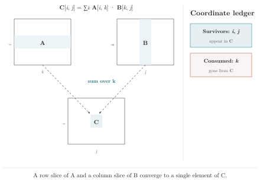

# Chapter 2 · The Megaphone's Promise

> "The absence of a signal is itself a signal."
>
> — Geoffrey Hinton (apocryphal)

*Primitives · Reduction and broadcasting*

---

A permutation moves coordinates around. A reduction makes one disappear. A broadcast makes one appear where it wasn't.

Reduction and broadcasting are inverses. They govern which coordinates a value depends on—and which it doesn't. The intuition: **a tensor is a speaker that speaks on some coordinates and stays silent on others.** The ones it stays silent on, it gets copied. The ones it speaks on, it can be summed away.

Chapter 1's parking lot showed what happens when a position moves: your ticket says D-7 but the car that was there is gone. Now face the more common case. The position didn't move. The car did. You sit in the same seat, but the class changed from math to history. `dim=1` still points to axis 1—but axis 1 used to be `channel`, and now it's `spatial`. The number is stable. The meaning drifted.

This is the megaphone model. Once you have it, you have the core of every tensor computation.

---

## What Is a Tensor?

Ask a framework documentation and it will tell you: a multidimensional array. Ask a tensor's `.shape` attribute and it will tell you: `(32, 64, 256)`. Ask a compiler and it will tell you: a pointer to a contiguous block of memory with strides and a dtype.

All true. All missing the point.

A tensor is a function from coordinates to values. You give it a `batch` index, a `channel` index, and a `spatial` index; it gives you back a number. The three coordinates together form an address. Every element in the tensor lives at exactly one address.

This definition is not exotic. It is how mathematicians have written tensor operations for a century:

$$C_{ij} = \sum_k A_{ik} B_{kj}$$

The letters `i`, `j`, and `k` are not axis numbers. They are coordinate names. `i` walks the rows of `A`. `j` walks the columns of `B`. `k` walks the dimension they share—the one that gets summed away. You can rename `i` to `row`, `j` to `col`, `k` to `inner`, and the mathematics is unchanged.

Now look at how we write the same operation in a modern framework:

```python
C = torch.matmul(A, B)
```

Where are `i`, `j`, and `k`? They are gone. The names that gave the operation its meaning are not present in the source text. The compiler knows the shapes of `A` and `B`. It checks that the inner dimensions agree. It does not know—cannot know—that `A`'s second axis represents `feature` and not `time`, or that `B`'s first axis represents `feature` and not `vocab_size`. It only knows that both are `64`.

---

## The Megaphone

Imagine a tensor `bias[j]` as a person holding a megaphone. The megaphone is pointed at coordinate `j`. On `j`, the value speaks—`bias[0]` is one number, `bias[1]` is another, each position carries its own meaning. On every other coordinate—coordinates not in the bracket—the megaphone is silent.

What happens when silence meets a coordinate? The value gets copied. If you write:

```rust
let out[i, j] = A[i, j] + bias[j];
```

`bias` has no `i` in its brackets. It is silent on `i`. This silence is a declaration: "the value of `bias` does not depend on `i`. Whatever `i` you ask for, the answer is the same." So the value is copied across all 32 values of `i`—not because it saves keystrokes, but because the indexing pattern makes a semantic claim: `bias` is independent of batch identity.

This is broadcasting. Not a shape-compatibility hack. A semantic declaration: "this value does not depend on that coordinate." The claim is **statically verifiable**: every use of `bias` is traced, and if any context requires `bias` to vary with `i`, the omission is flagged. Broadcasting is a promise, and the promise is checked.

Now stop. Look at that line again: `let out[i, j] = A[i, j] + bias[j]`. Ask yourself: does `bias` depend on `i`? How do you know?

You probably just looked at the bracket after `bias`. It says `[j]`—no `i`. That is how you know. You compared `bias`'s coordinate set `{j}` against the output's coordinate set `{i, j}` and noticed that `i` is missing. You performed **coordinate set subtraction** in your head, without being taught the procedure.

What you just did—comparing coordinate sets, finding the missing ones—is exactly what can be done by static analysis. Let's give this operation a name, because you will see it again and again:

```
paths(X, Out) = coordinates(Out) \ coordinates(X)
```

`paths(bias, out)` is the set of coordinates in `out` that `bias` is silent on. These are the broadcast coordinates. In the backward pass, they become the reduction coordinates—the coordinates the gradient sums over. Call it the path set. Remember it.

Take the output coordinate set. Subtract each operand's coordinate set. The difference is the coordinates that operand broadcasts over:

```
Output coordinates: {i, j}
A's coordinates:    {i, j}  → paths(A, out) = {}     (no omission)
bias's coordinates: {j}     → paths(bias, out) = {i}  (omitted i)
```

No execution required. The brackets contain all the information needed. Every broadcast is verified consistent across all uses of the broadcast value. If one expression claims `bias` is independent of `i` and another requires it to vary with `i`, it is a coordinate contract violation—caught before a single value is computed. Not magic. Set subtraction.

---

### The Broadcast Derivation

Here is the expression:

```rust
let out[b, c, h, w] = x[b, c, h, w] + scale[c, w];
```

`x` is a 4D tensor. `scale` is 2D. The output `out` is 4D. Broadcasting must be happening—`scale` has two coordinates, but the output has four. Which coordinates does `scale` broadcast over?

Look at what the brackets contain. The output has `{b, c, h, w}`. `x` has `{b, c, h, w}`. `scale` has `{c, w}`. The difference—output set minus operand set—is the broadcast:

```
Output coordinates:  {b, c, h, w}
x's coordinates:     {b, c, h, w}  → broadcasts over: {}      (no omission)
scale's coordinates: {c, w}        → broadcasts over: {b, h}  (omitted b and h)
```

No arithmetic, no execution. The brackets contain the answer. `scale` broadcasts over `b` and `h`. It is silent on batch and height. It speaks on channel and width.

What just happened: you compared coordinate sets. `x`'s brackets contain all four output coordinates—nothing missing. `scale`'s brackets contain only `{c, w}`—the missing two, `{b, h}`, are the broadcast. This is coordinate set subtraction, performed directly from the brackets, without shape arithmetic.

Now the crucial follow-up question: **is this broadcast semantically correct?**

`scale[c, w]` declares that the scale factor depends on channel and width, but not on batch or height. Does that make sense for your application? Maybe. Maybe `scale` should actually depend on `h`—perhaps it's a height-dependent normalization factor. If it should depend on `h`, the broadcast over `h` is a bug.

Here's the key: in the Einlang version, you can *see* the broadcast and *audit* it. The omission of `h` from `scale[c, w]` is visible. You can ask: "should `scale` really be silent on `h`?" The question has a place to land.

---

**Derive it yourself.** Before continuing, take this expression:

```rust
let out[batch, class] = logits[batch, class] - max_logit[class];
```

`logits` has coordinates `{batch, class}`. `max_logit` has `{class}`. Output has `{batch, class}`. What coordinate does `max_logit` broadcast over? Is the broadcast semantically justified? What should the gradient sum over?

---

Now look at the positional equivalent:

```python
out = x + scale[:, None, :, None]  # or some permutation of None
```

Where does `scale` broadcast? You'd need to decode the `None` positions, map them to the dimension order of `x`, and then check whether those dimensions are the ones `scale` should be silent on. If the dimension order of `x` changes, the `None` positions must change. The broadcast is there, but it's encoded as a shape manipulation, not as a semantic claim.

The Einlang version records the claim: `scale` is silent on `b` and `h`. The claim is visible. The claim is auditable. If the claim is wrong, the reader can see it. If the claim is right, the reader can verify it. Either way, the information is in the notation.

That is coordinate set subtraction—mechanical, exhaustible, requiring only the brackets. The compiler does the same thing for every expression in your program, every time, without fatigue. The difference is that the compiler does it for all of them.

---

Now the inverse. If broadcasting is silence—staying quiet on a coordinate so you are copied along it—reduction is speaking: naming the coordinate you consume, marking what disappeared.

```rust
let total = sum[i](data[i]);
```

`sum[i]` picks up the megaphone and points it at `i`. "I am going to speak on `i`—by summing over it. After this line, `i` is consumed." The coordinate `i` appears in the reduction bracket and is absent from the result. `total` is a scalar.

Reduction and broadcasting are the same megaphone, pointed in opposite directions. Broadcasting says "I am silent on `i`—copy me." Reduction says "I am speaking on `i`—consume me."

**Draw the megaphone.** For each expression below, determine which way the megaphone points. If the megaphone points AT a coordinate, that coordinate is being consumed (reduction). If the megaphone points AWAY from a coordinate, the value is being copied along it (broadcast). If the megaphone is quiet—the coordinate appears in the brackets without a `sum`—the value speaks on that coordinate normally.

1. `let out[i, j] = A[i, j] + bias[j];` — what does `bias`'s megaphone do on `i`? On `j`?
2. `let total = sum[k](data[k]);` — where is the megaphone pointing? What happens to `k`?
3. `let col_max[j] = max[i](matrix[i, j]);` — two coordinates. Which one gets consumed? Which one survives?
4. `let out[b, c, h, w] = x[b, c, h, w] + scale[c, w];` — `scale` has two coordinates but the output has four. Which coordinates does `scale` speak on, and which is it silent on?

The answers are not the point. The point is that you can answer all four questions by looking at the brackets, without knowing the shapes. Broadcasting is silence. Reduction is speech. The bracket tells you which is which.

---

## Rectangular Declarations

To eliminate or broadcast a coordinate, name the ones being kept. In Einlang, you name coordinates with a **rectangular declaration**:

```rust
let doubled[i, j] = matrix[i, j] * 2.0;
```

The `let` binds a new, immutable tensor. The `[i, j]` on the left declares the output coordinates—the new tensor will have two dimensions, named `i` and `j`. The `matrix[i, j]` on the right indexes the input tensor `matrix` by those same coordinates. It is inferred that `i` ranges from `0` to `matrix.shape[0]` and `j` from `0` to `matrix.shape[1]`.

This is not a loop. It is a declaration. You are stating a fact: "for all `i` and `j` in their respective domains, `doubled[i, j]` equals `matrix[i, j] * 2.0`." Iteration is handled automatically. You handle the meaning.

---

## Reduction

Now the main event. A reduction iterates over a coordinate and combines all the values along it using an associative operation. The coordinate appears in the reduction bracket—and then it is gone from the result:

```rust
let total = sum[i](data[i]);
```

`sum[i](...)` says: for every value of `i`, evaluate the body `data[i]`, and sum the results. The coordinate `i` is introduced by the `sum`, used in the body, and consumed by the reduction. It does not appear in `total`—`total` is a scalar.

Here is a subtlety that matters later. The `i` in `sum[i](data[i])` is a **local index variable**, not a coordinate identity. If `data` was declared as `let data[k in 0..5] = ...`, then `sum[i](data[i])` still works—`i` is just the name you chose for the loop variable inside this reduction. It does not need to match the name `data` was declared with. `sum[k](data[k])`, `sum[i](data[i])`, `sum[q](data[q])` are all equivalent.

You can even omit the brackets on the tensor entirely: `sum[i](data)`. No `[i]` on `data`—the compiler knows `data` has one coordinate and `sum[i]` consumes it. This is the **implicit** form of Einstein access. The explicit form (`data[i]`) and the implicit form (`data`) are both legal inside a reduction body. The index variables belong to the expression, not to the tensor.

This is different from the **rectangular access** notation used in coordinate-aware functions. When you write `x[..b, class]` inside a function body, `class` is not a local variable—it must match a coordinate that actually exists on `x`. Einstein index variables are scoped to the reduction body. Rectangular coordinates are scoped to the tensor's type. The distinction is invisible in simple examples, but it becomes the foundation of the type-checking system in Chapters 3 through 5.

The four reduction operations are `sum`, `max`, `min`, and `prod`. Each has an identity element: `sum` starts from `0`, `prod` from `1`, `max` from negative infinity, `min` from positive infinity.

A reduction can leave some coordinates intact—producing a tensor rather than a scalar:

```rust
let row_sums[i] = sum[j](matrix[i, j]);
let col_sums[j] = sum[i](matrix[i, j]);
```

These two lines produce the same output shape (a 1D tensor of length equal to the surviving coordinate). But they mean completely different things. `row_sums[i]` sums over columns, leaving rows. `col_sums[j]` sums over rows, leaving columns. The difference is entirely in the bracket after `sum`—one character, carrying the full semantic weight of the operation.

In a positional API, these would be `matrix.sum(dim=1)` and `matrix.sum(dim=0)`. The reader must remember which position is rows and which is columns. The code does not help.

The same pattern scales to matrix multiplication. Here is the full picture:



A row of A and a column of B share `k`. The sum consumes it. A single element of C remains. The ledger on the right records the transaction: survivors and consumed. Those are the only two facts any reduction ever produces. The diagram is the ledger, drawn instead of tabulated. The five-step procedure is the ledger, written instead of drawn. They are the same check.

Beyond the four numeric reductions, two more complete the set: `all` and `any`. They are boolean quantifiers. `all[i](x[i] > 0)` asks whether every position along `i` is positive. `any[i](x[i] > 0)` asks whether at least one is. The coordinate `i` is the quantified variable—exactly as in mathematical notation. The quantifier reduces over `i` and produces a boolean scalar. `i` is consumed.

Multi-coordinate quantifiers work the same way:

```rust
let is_symmetric = all[i, j](matrix[i, j] == matrix[j, i]);
```

`all[i, j]` is the universal quantifier over two coordinates: for all `i` and `j`, check that `matrix[i, j]` equals `matrix[j, i]`. The coordinates `i` and `j` are the bound variables. Both are consumed. The result is a single boolean.

Quantifiers are reductions. Their identity elements are `true` (for `all`) and `false` (for `any`). They compose with the same coordinate set subtraction, the same broadcasting rules, and the same gradient machinery as `sum` and `max`. The bracket names the quantified variable. The notation mirrors the mathematics. The distance is zero.

---

## The Two-Column Ledger

A reduction is the most semantically loaded operation in tensor programming. Every reduction makes two claims: which coordinate is being *consumed*, and which coordinates are *surviving*. When you read a reduction, draw an imaginary line down the middle of the page:

| Survivors | Consumed |
|-----------|----------|
| Coordinates that appear in the result | Coordinates introduced in the reduction bracket |
| They keep their identity | They are gone from the output |
| They can be used by later operations | They exist only within the reduction body |

For `let row_sums[i] = sum[j](matrix[i, j]);`:

- **Survivors**: `i` (appears on the left-hand side)
- **Consumed**: `j` (introduced by `sum[j]`, gone)

Five steps for reading any reduction:

1. **Identify the operation**: `sum`, `max`, `min`, or `prod`—and which coordinates are in its bracket?
2. **Identify the survivors**: which coordinates appear on the left-hand side of the `let`?
3. **Identify the consumed**: which coordinates appear in the reduction bracket but not on the left?
4. **Verify alignment**: do the consumed coordinates index matching positions across all terms in the body?
5. **State the claim**: in one sentence, what does this reduction assert?

This takes five seconds. It catches the bug where `sum[class]` silently became `sum[batch]` after a refactoring.

---

## Broadcasting: The Explicit Omission

Broadcasting is the inverse of reduction. A reduction consumes a coordinate. A broadcast copies along one.

In Einlang, broadcasting is not a shape-compatibility rule that triggers automatically when dimensions happen to align. It is a visible omission in the indexing pattern:

```rust
let out[i, j] = A[i, j] + bias[j];
```

The coordinate `i` appears on `A` and `out`, but not on `bias`. Its absence from `bias` is the notation for broadcasting: `bias` is indexed only by `j`, so it is replicated across all values of `i`. The code states the semantic claim directly—`bias` does not depend on `i`—and the claim is visible to both the reader and static analysis.

Compare this to the implicit version: `A + bias`. The shapes match. The broadcast happens. But *which coordinate was broadcast over*? You have to know the shapes to answer that. And if the shapes change upstream, the answer changes with them, silently.

This is the principle of explicit omission: **if a term is independent of a coordinate, the indexing should show it.** When the indexing shows it, the reader can audit it. When the indexing hides it, the reader must guess.

Now look at a pair of broadcasts side by side:

![Both produce out[i,j]. Identical shape, indistinguishable by shape. The coordinate name is the semantics.](figures/broadcasting.svg)

On the left, `bias[j]` omits `i` — the value repeats for each row. On the right, `bias[i]` omits `j` — the value repeats for each column. Both produce `out[i, j]`. The output shape is the same. If you saw only the shape, you could not tell which broadcast happened. The coordinate name in the bracket is the only thing that records the difference.

The verification that follows formalizes what the eye just saw:

Take the output coordinate set. Subtract each operand's coordinate set. The difference for each operand is the set of coordinates that operand broadcasts over:

```
Output coordinates: {i, j}
A's coordinates:    {i, j}  → broadcasts over: {}     (no omission)
bias's coordinates: {j}     → broadcasts over: {i}    (omitted i)
```

This set subtraction is statically computable from the indexing patterns alone—no execution required. The brackets are read, the differences are computed, and every broadcast is verified consistent across all uses of the broadcast value. If one expression claims `bias` is independent of `i` and another expression requires it to vary with `i`, it is a coordinate contract violation—caught before a single value is computed.

---

## Named Rest: `..b`

So far our coordinates have been single, explicit names. But real tensor code often needs to be polymorphic over how many batch dimensions there are. A normalization function shouldn't care whether the input is `(batch, feature)`, `(batch, time, feature)`, or `(batch, head, time, feature)`. It only cares that `feature` is the last dimension and everything else is batch-like.

Einlang provides **named rest indices** for this:

```rust
let result[..b, j] = x[..b, j] + bias[j];
let row_sum[..b] = sum[j](x[..b, j]);
```

The notation `..b` stands for zero or more adjacent axes, collectively referred to as `batch`. The same rest name must describe the same axis span everywhere it appears within an expression. Which concrete axes `..b` covers is inferred from the shape of `x`.

This is not a wildcard. It is a named group. The name `batch` carries semantic weight—it says "these leading dimensions are all batch-like, and the operation treats them uniformly." If upstream adds a `head` dimension between `batch` and `time`, `..b` absorbs it automatically.

---

## The Where Clause

Sometimes a computation should only apply to a subset of coordinate values. In a positional API, you'd create a mask tensor, multiply, and hope the mask doesn't silently broadcast into the wrong dimension. In Einlang, you attach a **where clause** directly to the declaration:

```rust
let pos_sum = sum[i](data[i]) where data[i] > 0;
```

The where clause is evaluated for each combination of the enclosing index variables. For reductions, elements where the guard is false are skipped—the reduction's identity element is used instead.

A where clause can also bind intermediate variables to avoid recomputation:

```rust
let output[i, j] = activated
    where z = sum[k](input[i, k] * weight[k, j]) + bias[j],
          activated = if z > 0.0 { z } else { 0.0 };
```

Without the where clause, you'd write the `sum[k](...)` expression twice. With the where clause, you name the shared subexpression `z` and refer to it in `activated`. The bindings are evaluated in order; later bindings can reference earlier ones.

The where clause is not bolted onto tensor operations. It is the natural extension of the idea that declarations state facts over coordinate domains. A where clause narrows the domain over which the fact holds.

---

## The Inversion Rule

Broadcast and reduction are inverses. What you broadcast over in the forward pass, you reduce over in the backward pass. `bias[j]` omits `i` in the forward direction—broadcast. The gradient `dbias[j] = sum[i](dy[i, j])` consumes `i` in the backward direction—reduction. The omitted coordinate and the consumed coordinate are the same coordinate.

This pairing catches more bugs than any other single rule in this book. If a broadcast is shape-correct but semantically wrong, the gradient will sum over the wrong coordinate. If a reduction consumes `class` but the broadcast was over `batch`, the shapes might still match—but the gradient will silently compute a different quantity.

In PyTorch, write `x = torch.randn(8, 10); b = torch.randn(10); y = x + b`. The bias `b` broadcasts over the first dimension—but nothing in the code says so. If `x` is transposed upstream to shape `(10, 8)`, `x + b` still runs, but now broadcasts over the *second* dimension silently. In Einlang, `let out[b, c] = logits[b, c] + class_bias[c]` makes the broadcast visible: `class_bias` depends only on `c`, so the reader knows it is independent of `b`. The code says what it means.

---

---

## The Two-Column Ledger Revisited

Every reduction and broadcast can be read through the same lens: which coordinates survive, and which are consumed or copied. The Two-Column Ledger from Section 4 is the tool. Let's apply it to a more complex expression:

```rust
let norms[i] = sum[j]( (A[i, j] - mean[j](A[i, j])) ** 2.0 ) ** 0.5;
```

| Survivors | Consumed |
|-----------|----------|
| `i` (appears on the left-hand side) | `j` (consumed by `sum[j]` AND `mean[j]`) |

Two reductions, both consuming `j`. The ledger tells us: `j` is gone from the output. `i` survives. If `j` should have survived—if this was supposed to be a per-element normalization rather than a row normalization—the ledger catches it. The `j` in the reduction brackets says "I am consuming `j`." The `j`'s absence from the output says "I am gone." The reader can verify the intent against the ledger.

Now read the positional equivalent:

```python
norms = ((A - A.mean(dim=1, keepdim=True)) ** 2).sum(dim=1) ** 0.5
```

`dim=1` appears twice. Which coordinate is position 1? The code doesn't say. If `A` is transposed upstream, `dim=1` silently consumes the other coordinate. The two-column ledger for the positional version is empty—there are no names to record in the Survivors and Consumed columns. The ledger exists in the programmer's head. The named version puts it in the syntax.

The ledger is not a tool you run once. It is a reading habit. Every time you see a reduction bracket or an omitted coordinate in an index pattern, draw the line. Write the survivors on the left, the consumed on the right. If the survivors don't match the output coordinates, something is wrong. If the consumed doesn't match what you intended to consume, the bracket is wrong. The ledger catches both errors before the program runs.

---

### The Ledger for Broadcasting and Permutation

The Two-Column Ledger was introduced for reduction. But the same technique works for every tensor operation. The columns change, but the principle—write down the coordinate sets, compare them—stays the same.

**For broadcasting**, draw three columns:

| Output coordinates | Operand A's coordinates | Operand B's coordinates | B broadcasts over |
|:---|:---|:---|:---|
| `{b, c, h, w}` | `{b, c, h, w}` | `{c}` | `{b, h, w}` |

The "broadcasts over" column is the output coordinates minus the operand's coordinates. The difference is the claim—the coordinates the operand declares independence from.

**For permutation**, draw two rows—input and output—and align the coordinates:

```
Input:  [b,  h,  w,  c]
          |   |   |   |
Output: [b,  c,  h,  w]
```

The arrows trace where each coordinate goes. `b` stays. `c` moves from position 4 to position 2. `h` and `w` shift. The ledger records the mapping, not the positions. If the input layout changes—if it becomes `[b, w, h, c]`—the arrows still find their targets, because the arrows connect names, not numbers.

The ledger applied to a complex expression:

```rust
let norm[i] = sum[j]( (A[i, j] - mean[j](A[i, j])) ** 2.0 ) ** 0.5;
```

Look at the brackets. The left-hand side names `i`—that is the survivor. `sum[j]` and `mean[j]` both name `j`—that is consumed. Now the subtraction `A[i, j] - mean[j](A[i, j])`: `mean[j](A[i, j])` produces `{i}` because `mean` consumed `j`. But `A[i, j]` has `{i, j}`. Set subtraction: `{i, j} - {i} = {j}`. The mean result broadcasts back over `j`—the coordinate it just consumed.

What just happened: the ledger reveals three things from the brackets alone:
- Survivors: `{i}` (appears on the left-hand side)
- Consumed: `{j}` (consumed by both `mean[j]` and `sum[j]`)
- Broadcasts: `{j}` — the mean's result broadcasts back over the coordinate it consumed

The positional equivalent of this three-column ledger is `A.mean(dim=1, keepdim=True)`. The `keepdim=True` is the positional way of saying "broadcast back over the consumed coordinate." The ledger for the named version records *which* coordinate. The ledger for the positional version records *that* a coordinate was kept—but not which one.

---

## Common Errors: What the Brackets Catch

Every new notation has characteristic mistakes. Here are the ones the megaphone model catches—and the ones it can't. Learn to recognize both.

### Error 1: Reduction bracket disagrees with index

```rust
// ERROR: sum over j, but the index uses k
let wrong[i] = sum[j](matrix[i, k]);
```

The reduction bracket says `j`. The index pattern says `k`. `j` is not in the index list. The compiler reports: "reduction coordinate `j` does not appear in the tensor's index list. Did you mean `k`?"

The fix:

```rust
let right[i] = sum[j](matrix[i, j]);
```

This error is a typo—an easy one to make, an easy one to catch. In the positional version, this would be `matrix.sum(dim=1)` vs `matrix.sum(dim=0)`. Both compile. Only one is correct. The typo is invisible because there is no name to mismatch—there is only an integer, and all integers are valid.

### Error 2: Implicit broadcast that should be explicit

```rust
// DANGER: temperature declared as scalar, but should vary by class
let scaled[batch, class] = logits[batch, class] / temperature;
```

`temperature` is a scalar. It broadcasts over both `batch` and `class`. The shapes match. The output is correct shape. But `temperature` was supposed to be `temperature[class]`—a per-class temperature scaling. The scalar version averages all classes with the same temperature, silently.

The compiler catches this if `temperature` is declared with the wrong coordinate set. If `temperature` is declared as `temperature[class]` but used as `temperature` (without brackets), the compiler reports: "scalar used where `[class]` was expected." If `temperature` is declared as a scalar and that's wrong, the compiler can't catch it—but the declaration is visible, and the reviewer can ask: "shouldn't temperature vary by class?"

### Error 3: Broadcast over the wrong set of coordinates

```rust
// scale depends on c and h, but should also depend on w
let out[b, c, h, w] = x[b, c, h, w] * scale[c, h];
```

`scale[c, h]` broadcasts over `b` and `w`. The shapes work. But `scale` should vary with `w`—it's a per-width scaling factor. The omission of `w` from the bracket is a semantic error.

The compiler won't catch this. The broadcast is internally consistent. But the bracket makes the claim visible: `scale` is silent on `w`. The reader sees the claim and can challenge it. In `x * scale[:, None, :, None]`, the claim is encoded as shape manipulation. The reader has to decode the `None` positions, map them to the dimension order, and then ask the same question. The extra decoding step is where bugs hide.

### Error 4: Keepdim forgotten

In a positional API, forgetting `keepdims=True` is one of the most common tensor bugs:

```python
# Bug: mean returns (batch,) not (batch, 1), broadcast is wrong
x = x - x.mean(dim=1)  # missing keepdim=True
```

In Einlang, the broadcast requirement is derived from the coordinate structure, not from a flag:

```rust
let centered[b, c] = x[b, c] - mean[c](x[b, c]);
```

`mean[c](x[b, c])` produces a result with coordinates `{b}`. The subtraction expects `{b, c}`. The coordinate sets differ: `{b, c}` vs `{b}`. The missing coordinate is `c`. The compiler infers that the mean must broadcast back over `c`. `keepdims=True` is not a flag the programmer writes—it's a requirement the compiler derives from the coordinate structure.

The four errors form a gradient. Error 1 is caught unconditionally (name mismatch). Error 2 is caught if declarations are consistent (wrong coordinate set). Error 3 is not caught by the compiler, but the bracket makes the claim visible to the reader. Error 4 is eliminated entirely—the compiler derives the keepdims requirement from the coordinate sets, so the programmer cannot forget it.

---

The preceding sections covered the four primitives of tensor computation: naming (a coordinate has an identity), permutation (coordinates move by name, not position), reduction (the consumed coordinate is named in the bracket), and broadcasting (the omitted coordinate is visible by its absence). They all flow from a single idea: **the megaphone.** A tensor speaks on some coordinates and stays silent on others. Reduction silences a coordinate. Broadcast copies along one the tensor was already silent on. Naming makes the coordinates audible. Permutation moves them without changing who speaks.

---

## The Four Operations

Here is what each primitive looks like in two notations, and what each notation records:

| Operation | PyTorch/NumPy | Einlang | What the name records |
|:---|:---|:---|:---|
| **Reduce** | `x.mean(dim=1)` | `mean[channel](x[b, c, s])` | Which coordinate is consumed |
| **Broadcast** | `x + bias[:, None, :]` | `x[b, c, s] + bias[c]` | Which coordinates bias is silent on |
| **Permute** | `x.permute(0, 3, 1, 2)` | `y[b, c, h, w] = x[b, h, w, c]` | Where each coordinate ends up |
| **Contract** | `torch.matmul(A, B)` | `sum[k](A[b, k] * B[k, f])` | Which coordinate is shared and consumed |

In every case, the name records a fact about identity. In the positional version, that fact is not recorded—it lives in the programmer's head. When a refactoring changes the dimension order, the PyTorch column requires updates to every affected line. The Einlang column does not. `channel` is still `channel`, regardless of its position. The positional column records *how*. The named column records *what*.

---

### Three Questions Before You Continue

Every broadcast is a claim. Before you move on, ask these three questions of any broadcast you encounter:

1. **Which coordinate does this broadcast copy over?** Can you name it?
2. **Is it genuinely independent of that coordinate?** Does the value make sense without it?
3. **If the dimension order changed, would this broadcast still be correct?**

If you can't answer all three with confidence, the broadcast is an accident of shape alignment, not a defended claim. For now, the questions themselves are the habit.

The three questions apply to single operations. But real programs compose operations: softmax is a max, a subtract, an exp, a sum, and a divide—five steps, each involving coordinates with distinct roles. Chapter 3 introduces coordinate-aware functions, the mechanism that checks whether these compositions preserve the coordinate story across call sites. The question "does this broadcast make sense?" becomes "does this function's coordinate contract match its body?"
