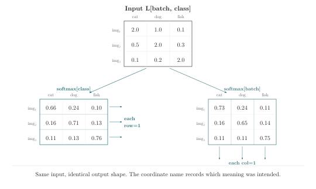

# Chapter 3 · Names as Contracts

> "The art of programming is the art of organizing complexity."
>
> — Edsger Dijkstra

*Combinations · Coordinate-aware functions*

---

A softmax is not one operation. It is a max reduction, a subtraction, an exponentiation, a sum reduction, and a division. Five steps, each involving coordinates with distinct roles. Five chances for a coordinate to go missing.

In a positional framework, each step's `dim=` argument must be correct independently. If the max is over `dim=-1` but the sum is over `dim=0`, the shapes might still align — and the bug ships. The individual operations are correct. The composition is wrong. Nothing in the positional notation records that the five `dim` arguments are supposed to refer to the same coordinate.

Part I taught us to name coordinates at individual operations. Part II asks: when operations compose, can the names survive the composition? The answer is yes — if the composition itself has a name, and that name is a contract.

---

## The Softmax Decomposition

Softmax is the workhorse of classification. It takes a vector of logits and returns a probability distribution:

$$\text{softmax}(x)_j = \frac{e^{x_j}}{\sum_k e^{x_k}}$$

Decomposed into primitives:

```rust
let m = max[j](logits[j]);
let e[j] = exp(logits[j] - m);
let z = sum[k](e[k]);
let probs[j] = e[j] / z;
```

Every reduction states what it consumes. `max[j]` consumes `j`. `sum[k]` consumes `k`. The reader can see, at each line, which coordinate is being collapsed.

Now look at that first line again. `max[j]`—a built-in reduction that accepts a coordinate in brackets. You have been writing these since Chapter 1: `mean[channel](x)`, `sum[batch](x)`, `max[j](logits[j])`. Built-in reductions take a coordinate parameter. The bracket after the operation name holds the coordinate identity. The compiler checks that the tensor has that coordinate.

But the softmax above is four separate `let` statements. Write it once, fine. Write it in twelve places across a codebase, and the coordinate story scatters. The reader must reconstruct, at each call site, that `j` and `k` are the same underlying coordinate. The compiler cannot check it, because `j` and `k` are local to each statement.

---

## Can a User Function Take a Coordinate?

The built-in reductions—`mean`, `sum`, `max`, `min`, `prod`—all accept coordinate parameters. You write `mean[channel](x)` and the compiler checks that `x` has a `channel` coordinate.

The question: can a user-defined function do the same thing?

Here is the standard positional approach:

```python
def softmax(logits, dim=-1):
    m = logits.max(dim=dim, keepdim=True)
    e = (logits - m).exp()
    return e / e.sum(dim=dim, keepdim=True)
```

`dim=-1` says "the last one." If the last dimension is `class`, correct. If upstream changes the dimension order, `dim=-1` silently normalizes over whatever happens to be last. The code runs. The output is a valid probability distribution—over the wrong coordinate.

The positional function cannot name which coordinate it normalizes over. The built-in `mean[channel]` can. The gap is not about convenience. It is about first-class status: in Einlang, coordinate parameters are available to any function—built-in or user-defined. The bracket is not a privilege reserved for `mean` and `sum`. It is a language mechanism, and user functions get the same mechanism.

---

**Derive it yourself.** You want to write `softmax` so it accepts a coordinate parameter the way `mean[channel]` does. What must the signature declare? The input has unknown surrounding dimensions plus the normalization coordinate. The output must preserve all input coordinates — the normalization doesn't remove any. The body needs a max, an exp, a sum, and a division. Which operation consumes the coordinate? Which broadcasts it back? Write the signature before turning the page.

---

## The Coordinate-Aware Function

Here is the same softmax, written so that it accepts a coordinate parameter the same way `mean[channel]` does:

```rust
fn softmax[j](x: [f32; ..left, j, ..right])
    -> [f32; ..left, j, ..right]
{
    let m[..left, ..right] = max[j](x[..left, j, ..right]);
    let e[..left, j, ..right] = exp(x[..left, j, ..right] - m[..left, ..right]);
    let z[..left, ..right] = sum[j](e[..left, j, ..right]);
    e[..left, j, ..right] / z[..left, ..right]
}
```

`fn softmax[j]`—the `j` in brackets after the function name is a coordinate parameter. The same bracket position that `mean[channel]` uses. This is not a new language feature. It is the existing coordinate-parameter mechanism, extended to user-defined functions. Coordinate parameters are first-class: any function, built-in or user-defined, can accept a coordinate in brackets.

`x: [f32; ..left, j, ..right]`—the parameter `x` is a tensor whose shape includes the coordinate `j`, plus zero or more leading coordinates (`..left`) and trailing coordinates (`..right`). These are packs—they stand for whatever coordinates surround `j` in the actual argument.

`-> [f32; ..left, j, ..right]`—the return type has the same coordinate structure as the input. The function preserves the normalized coordinate.

Now the call:

```rust
let logits[b, class] = model(x[b, feature]);
let p[b, class] = softmax[class](logits[b, class]);
```

The caller writes `softmax[class](...)`. The same bracket syntax as `mean[channel]`. The `class` in brackets is a coordinate argument—the name of the dimension the function normalizes over. That `logits` has a `class` coordinate is checked: the compiler subtracts `{class}` from `logits`'s coordinate set `{batch, class}` and finds a match. If `class` were absent, the set subtraction would produce an empty intersection, and the call would be a compile error. This is coordinate set subtraction, introduced in Chapter 2, applied to function calls.

Compare to the standard API:

```python
p = torch.softmax(logits, dim=-1)
```

The same positional call. The same silent failure mode: if the last dimension changes, `dim=-1` follows the position, not the identity. The code runs. The output is a valid probability distribution—over the wrong coordinate.

Now compare to a different Einlang call:

```rust
let p[b, class] = softmax[b](logits[b, class]);
```

This normalizes over `b`—the batch dimension. It is a one-character bug (`b` instead of `class`). It is also a compile error, because `softmax[b]` would attempt to consume `b`, and the function signature says `b` should survive in `..left`. The coordinate contract catches the error at the call site.

Now pause and think about a different kind of failure. You write `softmax[class](logits)` and it works. Three months later, a colleague refactors the model. They rename the `class` coordinate to `category`—a better name, more consistent with the rest of the codebase. They update twenty-three files. They miss one: the call to `softmax[class]`. What happens?

The call is now `softmax[class](logits[b, category])`. The compiler checks: does `logits` have a `class` coordinate? No—it has `batch` and `category`. The error is not "shape mismatch." It is not "dimension 1 out of bounds." It is: **`logits` has no coordinate named `class`.** The error message names the missing coordinate. The fix is to change one character in the brackets: `softmax[category](...)`.

In the positional equivalent, `dim=1` would stay correct if only the name changed—but if the dimension order also changed, `dim=1` would silently begin normalizing over the wrong coordinate. No error. No warning.

Here is the distinction in one sentence: **when positions change without names changing, `dim=-1` silently becomes wrong. A named coordinate fails loudly. A positional API fails silently.**

Neither notation prevents all errors. But named coordinates make the errors *visible*. A compile error is visible. A silent semantic drift is not.

---

## One Coordinate, Three Jobs

Inside `softmax[j]`, the coordinate `j` plays three distinct roles:

```rust
let m[..left, ..right] = max[q](x[..left, q, ..right]);    // Role 1: stability scan
let e[..left, k, ..right] = exp(x[..left, k, ..right] - m); // Role 2: exponentiate
let z[..left, ..right] = sum[j](e[..left, j, ..right]);     // Role 3: normalize
```

All three—`q`, `k`, `j`—range over the same domain (the class axis). But each carries a different **gradient contract**. The stability scan passes a sparse gradient: only the maximum element receives a signal. The denominator scan passes a dense gradient: every element contributes to the sum. The output has a diagonal-plus-off-diagonal structure: each element's gradient depends on itself and on every other element. The coordinate `j` is consumed by `max`, consumed again by `sum`, and reconstructed by the division—two different consumption events on the same coordinate, with the coordinate surviving both.

In a `dim=-1` API, these three roles collapse into a single integer. The reader cannot see which role `dim=-1` plays at each step. In the named-coordinate version, the roles are given distinct letters, and a reader can audit whether the gradient contracts are satisfied.

Now ask yourself: why use three different letters (`q`, `k`, `j`) for the same coordinate? Why not just `j` everywhere? Because the *binding site* of each occurrence carries different gradient implications. `max[q]` says: "I consume `q` and return a scalar per batch element. The backward pass through me will broadcast the gradient signal to only the maximum element." `sum[j]` says: "I consume `j` and return a scalar per batch element. The backward pass through me will broadcast the gradient signal to *all* elements." Same coordinate domain. Different gradient contracts. Different letters make each contract's scope visible: `q` is consumed by `max` and never seen again. `k` is used in the exponent and survives. `j` is consumed by `sum` and reconstructed by the division.

The letters are not decoration. They are the scope markers for the coordinate's three lives. In `dim=-1`, all three are the same integer. The scopes are invisible.

## Function Composition

Coordinate-aware functions compose. The output of one becomes the input of another, and the coordinate contracts chain.

Consider a pipeline: linear layer, then softmax:

```rust
fn linear[in, out](x: [f32; ..b, in], W: [f32; out, in], b: [f32; out])
    -> [f32; ..b, out]
{
    sum[in](x[..b, in] * W[out, in]) + b[out]
}

fn pipeline[in, class](x: [f32; ..b, in], W: [f32; class, in], b: [f32; class])
    -> [f32; ..b, class]
{
    let logits[..b, class] = linear[in, class](x[..b, in], W[class, in], b[class]);
    softmax[class](logits[..b, class])
}
```

The coordinate `class` flows from the pipeline's signature through `linear[in, class]` into the result `logits`, then into `softmax[class]`. At each step, the compiler checks: does the argument carry the coordinate the function expects? `linear` expects `in` and `out`—the caller binds `class` to `out`. `logits` now carries `class`. `softmax[class]` expects `class` on its argument—`logits` has it. The chain is verified.

If a refactoring changes `linear`'s output coordinate from `class` to `category`, the pipeline still compiles—`linear[in, category]` produces a tensor with `category`, and `softmax[class]` complains that `category` is not `class`. The error is at the composition boundary. The compiler names both coordinates. The mismatch is visible.

Positional composition has no such check. The chain is unverified.

---

## The Contract in One Question

Every coordinate-aware function can be audited with a single question: **does the caller's argument carry the coordinate that the function claims to operate on?**

If yes: the call compiles, and the coordinate flow is guaranteed consistent. If no: the call is rejected, and the error message names the missing coordinate.

This is the difference between a type-level contract and a documentation-level contract. `def softmax(logits, dim=-1)` has a documentation-level contract: the docstring says `dim` is the class dimension. But nothing checks it. `fn softmax[j](x)` has a type-level contract: `j` is a coordinate parameter, and the compiler verifies that the argument carries it. The contract is not a hope. It is a check.

The rest of this book builds on this distinction. Every chapter from here forward—skeletons, recurrences, gradients, comparisons—assumes that coordinate identities can be checked. The coordinate-aware function is the mechanism that makes checking possible.

---

## Domain and Extent

A coordinate has three properties. You've seen the first two: a **name** (`batch`, `class`) and a **domain** (the set of values it ranges over). The third is **extent** — the size of the domain, the number you see in a shape tuple.

Extent and domain are different things. `class` and `expert` may both have extent 1024. They are not the same coordinate. A tensor of shape `(1024, 1024)` could be `[class, expert]`, `[expert, class]`, `[batch, class]`, or `[seq, hidden]`. The extents are identical. The domains are different.

Positional notation records only the extent: `(1024, 1024)` tells you the sizes. It does not tell you which is which. Named notation records both: `[class: 1024, expert: 1024]`. The distinction is not academic — it is the root cause of every Square Matrix Test failure in this book. When two extents are equal, shape checkers become domain-blind. Names restore sight.

Keep this distinction in mind through the next section. The Square Matrix Test probes exactly this gap.

---

## The Square Matrix Test

There is a simple, brutal test for whether a piece of tensor code is robust to coordinate swaps. Set all dimension sizes equal. Swap two axes. Ask: does the program still mean the same thing?

For a square input where `batch_size == num_classes == 128`:

```rust
let probs[batch, class] = softmax[class](logits[batch, class]);   // correct
let probs[class, batch] = softmax[batch](logits[class, batch]);   // bug
```

Both lines produce a `(128, 128)` matrix where every row sums to 1. The cross-entropy loss descends identically. The training curves overlay perfectly. But the first normalizes classes against each other. The second normalizes examples against each other.

When `batch_size == num_classes`, the probability matrix is square. Softmax over rows and softmax over columns produce the same numbers when the matrix has symmetric structure. The loss curves overlay. The calibration reports pass. Six weeks later, a deployed model silently normalizes examples against each other instead of classes against each other.



Horizontal dividers: each row sums to 1. Vertical dividers: each column sums to 1. Same input, same output shape, different numbers. The only difference in the source code is the name inside the bracket. `class` versus `batch`. One word. `dim=-1` does not contain that word. It cannot. The word is in your head—exactly where the shape-meanings gap puts it.

No shape checker catches this. No gradient check catches this. Only a notation that records *which coordinate is the distribution* catches this.

The Square Matrix Test is named after this property: when all extents are equal, a coordinate swap can hide inside shape compatibility. If square matrices fool shape checkers—and they do, routinely—what can prevent this class of error?

The Square Matrix Test is not specific to softmax. It applies to any operation where two coordinates can have equal extents. Consider three more cases:

**Matrix multiplication.** `C[i, j] = sum[k](A[i, k] * B[k, j])` and `C[i, j] = sum[k](A[k, i] * B[k, j])` produce the same shape when `A` is square. The first uses `A`'s rows. The second uses `A`'s columns (equivalent to `A^T @ B`). When `A` is a square matrix of size `128 × 128`, both expressions produce a `128 × 128` output. Shape checkers see the same shape. Only the coordinate names distinguish the two computations.

**Broadcast.** `let out[i, j] = A[i, j] + bias[j]` and `let out[i, j] = A[i, j] + bias[i]` both produce shape `(128, 128)` when `i` and `j` have the same extent. The first broadcasts `bias` over rows—bias depends on columns. The second broadcasts `bias` over columns—bias depends on rows. Semantically opposite. Shape-identical. Distinguishable only by which coordinate appears in `bias`'s bracket.

**Attention.** Self-attention and cross-attention use the same `matmul(Q, K.transpose(-2, -1))` operation. When `seq_q == seq_k`, the code is textually identical. The distinction between attending to yourself and attending to a different sequence lives in the tensor shapes at runtime—not in the source code. When the sequence lengths differ, the shapes diverge and the bug surfaces. During development, when they happen to be equal, the bug is invisible.

In every case, the Square Matrix Test reveals the same gap: shape compatibility checks the arithmetic of dimensions. It does not check the identity of dimensions. When two dimensions have the same size, shape compatibility becomes identity-blind. Named coordinates restore sight.

---

Take a breath. Four cases. Softmax, matmul, broadcast, attention. All of them can fail silently when two extents match. The Square Matrix Test is not a trick — it is the normal state of deep learning models, where embedding dimensions, hidden sizes, and projection dimensions are routinely set to the same value. If your `d_model` is 512 and your `d_ff` is also 512 — which happens in the original Transformer — positional notation cannot distinguish them. Your code works. Your shapes match. Your coordinate identities are invisible to every tool you have.

The test is not hypothetical. It is a property of your current codebase. Every pair of equal-sized dimensions is a potential Square Matrix Test that your tooling is failing right now. The only question is whether a bug has found one yet.

---

## The Refactoring: A Detailed Demonstration

**Derive it yourself.** You have three files. `data.ein` declares `logits[batch, class]`. `model.ein` calls `softmax[class](logits)`. `loss.rs` calls `cross_entropy[class](probs, labels)`. A colleague renames `class` to `category` in `data.ein`. Which files break? What do the error messages say? Write the two errors on paper. Then read on.

---

A refactoring in both notations, to see where the errors surface—and where they don't.

The colleague makes the rename. Two errors appear:

```
error[E0425]: model.ein:42: tensor `logits` has no coordinate named `class`
  --> model.ein:42:20
   |
42 |     softmax[class](logits);
   |                    ^^^^^^ `logits` has coordinates: batch, category
   |     help: did you mean `category`?

error[E0425]: loss.rs:15: tensor `probs` has no coordinate named `class`
  --> loss.rs:15:25
   |
15 |     cross_entropy[class](probs, labels);
   |                         ^^^^^ `probs` has coordinates: batch, category
   |     help: did you mean `category`?
```

The colleague fixes both: `class` → `category`. The project compiles. Done. The compiler verified every use of the old name was updated.

**Now replay with a positional API.** The colleague changes the comment in `data.py`: the shape is now `(batch, category)`. `dim=1` is still `1`. Every `dim=1` is still correct—because the position didn't change. The refactoring compiles silently.

But if the dimension order also changed—say `(category, batch)`—some `dim=1`s should become `dim=0`s. There are twenty-three of them across eight files. The colleague updates the ones they remember. The ones they forget compile silently. `dim=1` is always a valid integer. The compiler cannot distinguish the ones that should have changed from the ones that shouldn't.

The Einlang refactoring emits two errors—one per call site. The positional refactoring emits zero—even when the dimension order changes. Zero errors is not zero bugs. It is zero *detected* bugs. The coordinate name is the audit trail. The positional integer has none.

---

## The Language Gets a Name

The preceding chapters have been written in a notation that puts coordinate names in brackets, that requires reductions to state what they consume, that makes broadcasting explicit in the indexing pattern. This notation needs a name.

It is called **Einlang**—a contraction of "Einstein" and "language," acknowledging the debt to Einstein summation notation while distinguishing itself as a full programming language rather than a string-based convention.

It is called **Einlang**—a contraction of "Einstein" and "language," acknowledging the debt to Einstein summation notation while distinguishing itself as a full programming language rather than a string-based convention. A language where coordinates are first-class syntactic entities, not comments embedded in variable names. Where coordinate contracts are statically checked. Where the reader can audit coordinate flow without reconstructing it from shape arithmetic.

---

A coordinate-aware function does something that no positional API can do: it makes the **identity** of the operated-on coordinate part of the function's type-level contract. The caller must name the coordinate. The name is checked against the argument's layout. The function body uses the name without knowing its position.

This is the combination layer. The primitives—naming, permuting, reducing, broadcasting—are composed into a function whose coordinate behavior is specified in its signature. The function can be called, passed around, and composed further, without losing the coordinate information that the primitives established.

But there is a subtler consequence. When coordinates are part of the type-level contract, refactoring becomes checkable. Rename a coordinate from `class` to `category`, and every call site that passes `class` becomes a compile error. The error message names the call site and the missing coordinate. The refactoring is systematic: change all `class` to `category`, and the errors disappear one by one. No silent breakage. No "hope I found all the places." The compiler is the audit trail.

In a positional API, renaming a dimension's role (e.g., changing what "position 1" means) produces no errors. The code compiles. The integer didn't change. Only the meaning changed. The compiler can't track meaning. It tracks integers. The refactoring is silent—and its bugs are silent with it.

The coordinate identity, made part of the function's contract, becomes auditable by the compiler rather than by the programmer alone.


---

A coordinate-aware function makes the coordinate part of the type-level contract. But the contract is not just a promise between programmer and compiler. It is a promise between the programmer who wrote the function and the programmer who calls it six months later. The bracket `softmax[class]` tells the future reader: "this function normalizes over `class`." The bracket `softmax(logits, dim=-1)` tells the future reader: "this function normalizes over the last dimension—whatever that is." One is a recorded decision. The other is a puzzle.

What does it take to make this contract real? Two pieces: the syntax that separates coordinates from values, and the mechanical steps the compiler uses to check them. Both are worth seeing once—not because you'll do them by hand, but because knowing what the compiler checks tells you what the contract guarantees.

---

### What Changes

If you look at a `dim=` argument in your own code right now, you can probably name the coordinate it refers to. `dim=1` means `channel`—you know that. The compiler doesn't. The name is in your head, not in the code.

Three things change when the name moves from your head into the bracket. First, the compiler can check it: if `dim=1` was supposed to be `class` but the data loader put `spatial` at position 1, the bracket `mean[class]` catches the mismatch. The positional `dim=1` catches nothing. Second, refactoring becomes safe: if `channel` moves from position 1 to position 2, `mean[channel]` follows the name. `dim=1` follows the position—silently. Third, a reader six months later sees `mean[channel]` and knows what was intended. They see `dim=1` and have to reconstruct the intent from context.

The coordinate habit is noticing that gap. The rest of this book is about what happens when you fill it.

---

## Under the Hood

Two pieces make the contract checkable. First, the syntax separates coordinate parameters from value parameters. Second, the compiler follows a six-step mechanical procedure for every call. Neither is complex. Both are worth seeing once.

### Brackets and Parentheses

You have been writing two kinds of things without naming the distinction. `softmax[class](logits)` — the `class` in brackets names a coordinate. The `logits` in parentheses holds data. They are different syntactic positions because they are different kinds of arguments. The bracket position says: "this is a coordinate identity—check it against the tensor's layout." The parenthesis position says: "this is a value—type-check it normally."

In `softmax(logits, dim=-1)`, `dim=-1` is syntactically identical to any other integer argument. If you pass `dim=42` by accident, the syntax has no opinion. It's just an integer. The bracket creates a syntactic position that the compiler recognizes as "coordinate argument." Everything in that position gets checked. The syntax carves out a space for coordinate verification—and the compiler fills it.

### The Six Steps

Here is the function signature:

```rust
fn softmax[j](x: [f32; ..left, j, ..right]) -> [f32; ..left, j, ..right]
```

And the call:

```rust
let probs[b, c] = softmax[c](logits[b, c]);
```

The six steps the compiler performs, mechanically, for every call:

| Step | Answer |
|:---|:---|
| 1. Coordinate parameter | `j` |
| 2. Coordinate argument | `c`, bound to `j` |
| 3. Does `logits` carry `c`? | Yes—`logits[b, c]` |
| 4. Pack bindings | `..left` = `[b]`, `..right` = `[]` |
| 5. Return type | `[f32; b, c]` |
| 6. Valid? | Yes |

No intuition, no shape arithmetic, no guessing. If any step fails, the compiler emits an error naming the missing coordinate.

Now a call that should fail:

```rust
let probs[b, f] = softmax[c](logits[b, f]);
```

Step 3 catches it: `logits` carries `b` and `f`. `c` is not in `{b, f}`. The compiler reports: "`logits` has no coordinate named `c`. Available coordinates: `b`, `f`."

Five wrong calls, and where each one breaks:

| Call | What goes wrong | Caught by |
|---|---|---|
| `softmax[class](logits[batch, feature])` | `logits` has no `class` | Step 3: index existence |
| `softmax[batch](logits[batch, class])` | `batch` would be consumed and returned—contract violation | Step 5: return type |
| `softmax[class](logits)` where `logits` is 1D | `class` exists, packs are empty—valid | No error (correct) |
| `softmax[class](logits[batch, class, extra])` | `..right` binds to `[extra]`—valid | No error (correct) |
| `softmax[class](logits[batch, class], wrong_arg)` | Wrong number of value arguments | Step 1: arity check |

Each check is a mechanical verification. You won't perform these steps by hand. But knowing they exist changes how you read a function call. `softmax[class](logits)` is not a request. It is a contract submission. The compiler either stamps it or rejects it. The stamp means the coordinate story is consistent.

### Where Coordinates Come From

Step 3 asks "does `logits` carry `c`?" But the compiler asks an even more fundamental question first: does `c` exist at all? A coordinate that appears from nowhere — referenced but never declared — is not a type error. It is a grounding error. The compiler calls it E0701.

You have now seen every way a coordinate can enter scope. There are exactly four:

1. **Declaration.** `let x[i, j]` — the output coordinates `i` and `j` are grounded by the `let`.
2. **Reduction.** `sum[k](...)` — the bracket introduces `k` as a bound variable inside the reduction body.
3. **Parameter type.** `x: [f32; ..left, j, ..right]` — the parameter's shape grounds `..left`, `j`, and `..right` in the function body.
4. **Coordinate parameter.** `fn softmax[j]` — the bracket after the function name grounds `j` as the coordinate the function operates on.

If a coordinate can't be traced to one of these four, the compiler stops. Not "maybe it's a free variable." Not "let's infer it from context." Error E0701, compile time, with the coordinate's name in the message.

The six steps check that coordinates are used *consistently*. The grounding check verifies that they *exist*. Together they guarantee that every coordinate you read has been declared somewhere — and that every declaration is checked against every use.

---

Coordinate-aware functions compose. But before seeing the pattern they form together, there is a more immediate question: when you write a broadcast, you are making a claim about coordinate independence. What is the claim? And who checks it?
