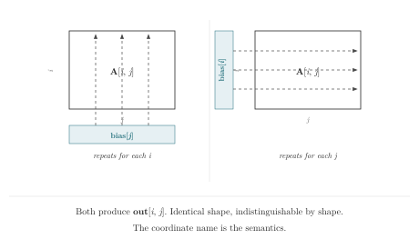

# Chapter 4 · Copy, and a Promise

> "The absence of a signal is itself a signal."
>
> — Geoffrey Hinton (apocryphal)

*Primitives · Broadcasting*

---

Broadcasting is one of the most convenient features of modern tensor frameworks. It lets you write `x + bias` when `x` has shape `(32, 64)` and `bias` has shape `(64,)`—the framework silently expands `bias` along the missing dimension, as if you'd written `x + bias.repeat(32, 1)`. It saves keystrokes. It saves memory. It reads cleanly.

It also buries a semantic claim inside a shape-compatibility rule.

The shape rule says: if a dimension has size 1 in one operand, it can be expanded to match the other operand's size at that position. The semantic claim says: the value along that dimension is *truly independent* of the coordinate being expanded. If `bias` has shape `(64,)` and you add it to `x` of shape `(32, 64)`, you are asserting that `bias` does not depend on `batch`—that the same 64 values apply identically to every one of the 32 batch elements.

The shape rule is checked by the compiler. The semantic claim is checked by no one.

When the claim is true, broadcasting is a clean, memory-efficient notation for a genuine structural fact. When the claim is false—when `bias` actually *does* vary with batch, but you accidentally loaded it at the wrong shape—broadcasting silently smears the wrong values across 32 batch elements. The shapes are compatible. The result is wrong.

---

## Broadcasting in einlang

Einlang takes a deliberate position: broadcasting is allowed, but only in cases where no coordinate name needs to be inferred. There are exactly two cases:

**Same-rank broadcasting.** Two tensors with identical shapes can be combined elementwise. No expansion needed:

```rust
let sum_AB[i, j] = A[i, j] + B[i, j];
```

**Scalar broadcasting.** A scalar can be combined with any tensor:

```rust
let scaled[i, j] = matrix[i, j] * 2.0;
let shifted[i, j] = matrix[i, j] + 10.0;
```

The scalar case is unambiguous—there are no coordinate names to infer, because a scalar has no coordinates.

**Everything else requires explicit indexing.** If you want to add a vector bias to a matrix, you must write the coordinate that the bias omits:




```rust
let out[i, j] = A[i, j] + bias[j];
```

The coordinate `i` appears on `A` and `out`, but not on `bias`. Its absence from `bias` is the notation for broadcasting: `bias` is indexed only by `j`, so it is replicated across all values of `i`. The code states the semantic claim directly—`bias` does not depend on `i`—and the claim is visible to both the reader and the compiler.

Compare this to the implicit version: `A + bias`. The shapes match. The broadcast happens. But *which coordinate was broadcast over*? You have to know the shapes to answer that. And if the shapes change upstream, the answer changes with them, silently.

---

## Named Rest: `..batch`

So far our coordinates have been single, explicit names. But real tensor code often needs to be polymorphic over how many batch dimensions there are. A normalization function shouldn't care whether the input is `(batch, feature)`, `(batch, time, feature)`, or `(batch, head, time, feature)`. It only cares that `feature` is the last dimension and everything else is batch-like.

Einlang provides **named rest indices** for this:

```rust
let result[..batch, j] = x[..batch, j] + bias[j];
let row_sum[..batch] = sum[j](x[..batch, j]);
```

The notation `..batch` stands for zero or more adjacent axes, collectively referred to as `batch`. The same rest name must describe the same axis span everywhere it appears within an expression. The compiler infers which concrete axes `..batch` covers from the shape of `x`.

This is not a wildcard. It is a named group. The name `batch` carries semantic weight—it says "these leading dimensions are all batch-like, and the operation treats them uniformly." If upstream adds a `head` dimension between `batch` and `time`, `..batch` absorbs it automatically. If upstream removes a dimension, `..batch` shrinks. The code does not need to change, because the code was written in terms of *roles*, not positions.

---

## The Principle of Explicit Omission

Broadcasting is not the only way a coordinate can be absent from an expression. Any time a coordinate appears in the output but not in a particular input term, that term is being implicitly replicated along that coordinate. The pattern is:

```rust
let y[i, j, k] = term1[i, j] + term2[j, k];
```

`term1` omits `k`—it is replicated along `k`. `term2` omits `i`—it is replicated along `i`. Both omissions are visible in the indexing pattern, because the coordinates are written explicitly.

This is the principle of explicit omission: **if a term is independent of a coordinate, the indexing should show it.** When the indexing shows it, the reader can audit it. When the indexing hides it, the reader must guess.

In the next chapter, we'll see what happens when broadcasting promises interact with gradients. A forward broadcast is a promise of independence. A backward gradient collects dependence. The two directions must agree—and when they don't, the bug is invisible to shape checks but visible to named coordinates.

**The Inversion Rule.** Broadcast and reduction are inverses. What you broadcast over in the forward pass, you reduce over in the backward pass. `bias[j]` omits `i` in the forward direction—broadcast. `dbias[j] = sum[i](dy[i, j])` consumes `i` in the backward direction—reduction. The omitted coordinate and the consumed coordinate are the same coordinate. Memorize this pairing. It catches more bugs than any other single rule in this book.

In PyTorch, write `x = torch.randn(8, 10); b = torch.randn(10); y = x + b`. The bias `b` broadcasts over the first dimension—but nothing in the code says so. If `x` is transposed upstream to shape `(10, 8)`, `x + b` still runs, but now broadcasts over the *second* dimension silently. In einlang, the declaration `let out[b, c] = logits[b, c] + class_bias[c]` makes the broadcast visible: `class_bias` depends only on `c`, so the reader knows it is independent of `b`. The code says what it means. The rest pack form `let out[..rest, c] = x[..rest, c] + shift[c]` works identically whether `x` has shape `(2, 3, 4, 5)` or `(6, 7)`—the broadcast over `..rest` is explicit, and the compiler checks that `shift` omits every coordinate in the pack.
