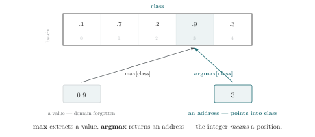
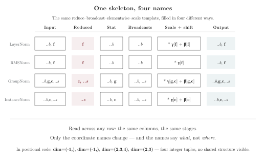

# Chapter 5 · Blocks and Skeletons

> "If you have a procedure with ten parameters, you probably missed some."
>
> — Alan Perlis

*Combinations · Pack polymorphism and normalization skeletons*

---

You've written four normalization functions in the past month.

LayerNorm for the Transformer. RMSNorm for the memory-efficient run. GroupNorm for the convolutional front-end. InstanceNorm for style transfer. Four functions, four different `dim` arguments, four different reshape chains. You checked each one in, wrote the tests, moved on.

Now look at them side by side. Really look. They are the same function.

Different `dim` values. Different internal statistics. But the structure — reduce, broadcast, elementwise, scale — is identical. The four functions differ only in *which coordinates* the reduction consumes and *which coordinates* the parameters broadcast over. Every other line is boilerplate that the skeleton demands.

What you discovered by inspection — "these four functions share a skeleton" — is invisible in the positional code. The `dim` arguments are different integers. The reshape chains are different lengths. The parameter shapes follow different conventions. The skeleton is there, but it's encoded as shape arithmetic. Only the coordinate names make it visible.

A coordinate pattern wrapped in a function signature produces a reusable block. Several such blocks reveal a common skeleton, dressed in different coordinate names. This chapter extracts that skeleton and shows what it buys.

---

## The Anatomy of a Coordinate-Aware Function

Here is the complete form:

```rust
fn normalize[coord](x: [f32; ..left, coord, ..right])
    -> [f32; ..left, coord, ..right]
{
    let m[..left, ..right] = max[coord](x[..left, coord, ..right]);
    let centered[..left, coord, ..right] = x[..left, coord, ..right] - m[..left, ..right];
    let scale[..left, ..right] = sum[coord](centered[..left, coord, ..right] ** 2.0);
    centered[..left, coord, ..right] / (scale[..left, ..right] ** 0.5 + 1e-5)
}
```

Look at the coordinate parameter `[coord]` in the signature. It appears in brackets after the function name and in the type signatures. It is not a value—you cannot do arithmetic on it. It is a coordinate identity. When the function body uses `max[coord]` and `sum[coord]`, it is verified that `coord` is the same parameter declared in the signature.

Now look at the rest packs `..left` and `..right`. They stand for whatever coordinates surround `coord` in the actual argument. If the caller passes `x[b, t, f]` and writes `normalize[f](x)`, then `..left` binds to `[b, t]` and `..right` binds to nothing. If the caller passes `x[b, h, f, d]` with `normalize[f](x)`, then `..left` binds to `[b, h]` and `..right` binds to `[d]`. The function body is polymorphic over the surrounding structure.

Trace the coordinate flow. Inside the function body, the coordinate `coord` is in scope. It can be used in reductions (`max[coord]`, `sum[coord]`), in indexing, and implicitly in the output shape. The packs `..left` and `..right` flow from the input signature to the output signature.

Finally, the return type annotation `-> [f32; ..left, coord, ..right]` tells you which coordinates survive. If the function body accidentally consumed `coord` without reconstructing it, or dropped a pack, a coordinate mismatch is reported.

---

## Packs and Polymorphism

Packs are what make coordinate-aware functions reusable across different tensor ranks.

A pack that comes before the coordinate of interest absorbs leading dimensions. Write `..left` or `..b` and all leading axes collapse into one named group.

A pack after the coordinate absorbs trailing dimensions. Write `..right` or `..rest` and everything after the named coordinate is captured.

A named spatial pack absorbs spatial dimensions as a group rather than individually. Write `..s` and a function that reshapes spatial coordinates can treat them as a unit:

```rust
fn move_channel[channel, ..s](x: [f32; channel, ..s])
    -> [f32; ..s, channel]
{
    x[..s, channel]
}
```

When a pack is ambiguous at the call site, the caller disambiguates by grouping:

```rust
id_axes[(height, width)](x)
```

Pack parameters make coordinate-aware functions rank-polymorphic: the same function works on 2D, 3D, 4D, or higher-dimensional tensors, as long as the coordinate of interest exists somewhere in the shape.

### How the Compiler Resolves Packs

How does the compiler know how many dimensions `..b` absorbs? The answer is the coordinate parameter.

Walk through a concrete call. The signature is `fn layer_norm[coord](x: [f32; ..left, coord, ..right])`. The caller writes `layer_norm[channel](x)` where `x` has layout `[batch, channel, height, width]`. The compiler's job: assign concrete dimensions to `..left` and `..right`.

The algorithm has four steps, executed once per call site:

**Step 1: Locate the anchor.** The caller supplied `coord = channel`. The compiler walks `x`'s layout `[batch, channel, height, width]` and finds `channel` at position 1. This is the only fact the compiler needs from the caller. Everything else follows from it.

**Step 2: Resolve `..left`.** `..left` appears before `coord` in the signature. The compiler looks at everything before position 1 in the layout: `[batch]`. `..left` binds to `[batch]`. If `..left` had appeared elsewhere in the signature, the compiler would verify that every occurrence binds to the same set — the pack must be consistent across all positions in the signature.

**Step 3: Resolve `..right`.** `..right` appears after `coord`. Everything after position 1: `[height, width]`. `..right` binds to `[height, width]`. Two steps, one anchor, zero ambiguity.

**Step 4: Rewrite the function body.** Every occurrence of `..left` in the body is replaced with `[batch]`. Every `..right` becomes `[height, width]`. Every `coord` becomes `channel`. The body `max[coord](x[..left, coord, ..right])` becomes `max[channel](x[batch, channel, height, width])`. The function is now monomorphic for this call site.

What if the layout doesn't match? The caller writes `layer_norm[channel](x)` but `x` has layout `[batch, seq, height, width]` — `channel` is nowhere in the layout. Step 1 fails. The compiler reports:

```
error: coordinate `channel` not found in argument layout
  → argument layout: [batch, seq, height, width]
  → called as: layer_norm[channel](x)
  → the coordinate parameter `coord` must match one coordinate in the argument
```

No guessing. No silent mismatch. The anchor is missing, and the compiler says so.

**Multiple packs, single anchor.** The same principle extends to signatures with several packs. `fn normalize[coord, ..left, ..right, ..s]` — three packs, one named coordinate. Step 1 finds `coord`. Step 2 splits `..left` (everything before `coord`). Step 3 splits `..right` (everything between `coord` and `..s`) and `..s` (everything after `..right`). Wait — how does the compiler know where `..right` ends and `..s` begins?

This is where pack disambiguation matters. Consider a pooling operation that collapses spatial dimensions:

```rust
fn pool[..s](x: [f32; ..b, ..s]) -> [f32; ..b] {
    max[..s](x[..b, ..s])
}
```

Only one pack — `..s` — is declared as a coordinate parameter. This is the pack the caller wants to name and control. The other pack, `..b`, appears in the value parameter's shape but is not a coordinate parameter — it's resolved by elimination: whatever coordinates remain after subtracting `..s` from the argument's layout. The caller writes:

```rust
pool[(h, w)](x)
```

A single parenthesized group `(h, w)` binds to `..s`. `..b` gets whatever is left: `[b]`. No ambiguity, because only one pack needs disambiguation.

The alternative design — declaring both packs as coordinate parameters with `fn pool[..b, ..s]` and grouping at the call site as `pool[(batch), (height, width)]` — is legal but unnecessary. When two adjacent packs both need caller grouping, the design fights itself. The simpler rule: declare only the pack you need to name. Let the compiler infer the rest by elimination.

This is the constraint on pack placement from the end of this section. A pack must be resolvable from the anchor coordinate alone. If two packs are adjacent with no named coordinate between them, the signature cannot determine the split — but you rarely need to declare both. Declare one. Let the other resolve. Adjacent packs in a signature are a signal: you are asking for a disambiguation problem. Move one of them to be implicit, and the problem disappears.

What about multiple named coordinates? A function can accept more than one coordinate in brackets:

```rust
fn max_over[j, k](x: [f32; ..left, j, ..right, k, ..rightmost])
    -> [f32; ..left, ..right, ..rightmost]
{
    max[j, k](x[..left, j, ..right, k, ..rightmost])
}
```

Two named coordinates — `j` and `k` — each acts as its own anchor. `..left` is everything before `j`. `..right` is everything between `j` and `k`. `..rightmost` is everything after `k`. Three surrounding packs, two anchors, one deterministic resolution. No caller grouping needed — the caller writes `max_over[h, w](x)`, two named coordinate arguments in brackets, and the compiler places each pack by position relative to the anchors.

The rule: **brackets hold what the caller must specify.** Named coordinates and packs that need caller disambiguation go in brackets. Packs that can be determined by elimination stay out — they appear in the value parameter's shape but not in the bracket list.

---

## Selection Reductions

You know `max[class]`. It gives you the largest value.

Now meet its cousin:

```rust
let pred[b] = argmax[class](logits[b, class]);
```

Both operate on the same input. Both consume `class`. They return different things.



Look at the figure. What does `max` return? What does `argmax` return? Before reading on: one returns a value extracted FROM the domain. The other returns an address that points INTO the domain. Which is which, and why does it matter?

---

`max[class]` extracts. The result is a scalar—the value 0.9, stripped of its `class` identity. You could pass that scalar to any function. The fact that it came from `class` position 3 is forgotten.

`argmax[class]` returns a pointer. The result is the integer 3—not just any integer, but an address in the `class` coordinate space. This integer carries a **domain contract**: the compiler knows it is only meaningful when used to index into a tensor that also carries `class`.

This contract is enforced. If you write:

```rust
let pred[b] = argmax[class](logits[b, class]);
let best[b] = embeddings[pred[b], class];
```

The compiler checks: does `pred[b]` carry the `class` address domain? Yes—it came from `argmax[class]`. Does `embeddings` have a `class` coordinate? Yes—it appears in the indexing expression. Do the domains match? Yes. The indexing is valid.

Now suppose you accidentally write:

```rust
let pred[b] = argmax[class](logits[b, class]);
let best[b] = vocabulary[pred[b], token];
```

The compiler reports:

```
error: address domain mismatch
  → `pred` carries addresses in domain `class` (from argmax[class] at line 1)
  → `vocabulary` has coordinate `token` at this position
  → expected coordinate `class`, found `token`
  → these domains are different; indexing across domains is not allowed
```

In PyTorch, this is silent. `pred` is a tensor of integers. `vocabulary[pred]` is a tensor of gathered values. Whether `pred`'s integers refer to class indices or token indices or pixel positions is invisible to the type system. Nothing prevents you from using classification predictions to index into a token embedding table. The bug survives testing until a user passes an out-of-range class index to a token embedding and the program crashes with a cryptic CUDA error, or worse, silently returns garbage.

The address domain contract is what makes `argmax` conceptually different from `max`. `max` says "give me the biggest thing in this set." `argmax` says "tell me WHERE the biggest thing is, because I need to go there." The WHERE is only meaningful relative to the coordinate domain it points into. The compiler tracks which domain that is.

This distinction propagates. If you have:

```rust
let top_k[b, k] = topk[class](logits[b, class], 5);
```

`top_k` is a tensor of five addresses per batch element, each an address in `class`. You can use it to index into any tensor that carries `class`. The compiler knows. The reader knows. The contract travels with the value.

Selection reductions—`argmax`, `argmin`, `topk`—are the only operations that produce address-typed values. Their results are not interchangeable with plain integers. They are typed by the coordinate domain they reference. This is the domain contract from Chapter 2, applied to the concept of "where" instead of "what."

---

## Four Normalizations

Here are four normalization implementations. Read them. Find what they share.

**LayerNorm:**
```python
def layer_norm(x, gamma, beta, eps=1e-5):
    mean = x.mean(dim=-1, keepdim=True)
    var = ((x - mean) ** 2).mean(dim=-1, keepdim=True)
    return (x - mean) / (var + eps).sqrt() * gamma + beta
```

**RMSNorm:**
```python
def rms_norm(x, gamma, eps=1e-5):
    rms = (x ** 2).mean(dim=-1, keepdim=True).sqrt()
    return x / (rms + eps) * gamma
```

**GroupNorm:**
```python
def group_norm(x, num_groups, gamma, beta, eps=1e-5):
    N, C, H, W = x.shape
    x = x.reshape(N, num_groups, C // num_groups, H, W)
    mean = x.mean(dim=(2, 3, 4), keepdim=True)
    var = x.var(dim=(2, 3, 4), keepdim=True)
    x = (x - mean) / (var + eps).sqrt()
    return x.reshape(N, C, H, W) * gamma + beta
```

**InstanceNorm:**
```python
def instance_norm(x, gamma, beta, eps=1e-5):
    N, C, H, W = x.shape
    mean = x.mean(dim=(2, 3), keepdim=True)
    var = x.var(dim=(2, 3), keepdim=True)
    return (x - mean) / (var + eps).sqrt() * gamma + beta
```

Look at the code. The common structure is visible across all four functions. Can you see the specific sequence of operations they all perform? What varies between them?

Here is what they share:

1. **Compute a statistic** (mean, rms, or both) by reducing over one or more dimensions.
2. **Broadcast the statistic back** over the reduced dimensions (via `keepdim=True`).
3. **Apply the statistic elementwise** (subtract and divide).
4. **Scale and shift** with learned parameters that broadcast over the non-feature dimensions.

Every one of these functions does: reduce, broadcast, elementwise, scale. The difference is only *which* dimensions are reduced and *which* parameters broadcast over *which* remaining dimensions.

But look at the code again. Can you *see* the shared structure? In LayerNorm, it's `x.mean(dim=-1, keepdim=True)`. In GroupNorm, it's `x.mean(dim=(2,3,4), keepdim=True)`. In InstanceNorm, it's `x.mean(dim=(2,3), keepdim=True)`. The `dim` arguments are different integers. The `keepdim=True` flag is the same. The `* gamma + beta` ending is the same.

The pattern IS there—but it's encoded as shape arithmetic. This shared structure is a **skeleton**: a reduce-broadcast-elementwise-scale template parameterized by which coordinates are reduced and which are preserved. `dim=-1` means one thing in LayerNorm ("the last dimension") and a completely different set of integers in GroupNorm ("dimensions 2, 3, and 4"). The skeleton is visible to a human who understands the dimension layout. It is invisible to a compiler. And it changes when the layout changes.

Now here is the same skeleton in Einlang:

| Function | Reduction coords | Broadcast params | Survivors |
|---|---|---|---|
| Softmax | `q` (max), `k` (sum) | none | `..b`, `j` |
| LayerNorm | `f` (mean ×2) | `gamma[f]`, `beta[f]` | `..b`, `f` |
| RMSNorm | `f` (mean) | `gamma[f]` | `..b`, `f` |
| GroupNorm | `c_in_group`, `..s` | `gamma[g, c_in_group]`, `beta[g, c_in_group]` | `..b`, `g`, `c_in_group`, `..s` |
| InstanceNorm | `..s` | `gamma[c]`, `beta[c]` | `..b`, `c`, `..s` |

The skeleton is visible in the table because the coordinates are named. Each column says *what*, not *where*. The reduction column names the consumed coordinates. The broadcast column names the parameters and their coordinate sets—the difference between the output set and the parameter set is the broadcast claim. This is coordinate set subtraction from Chapter 2, applied to four functions at once. The survivors column names what's left.

You might wonder: how does the compiler know that `mean[f]` reduces over `f` and not over `..b`? The answer is that `f` is a named coordinate — the bracket says `mean[f]`, not `mean[..b]`. Packs can appear in reduction brackets too (`mean[..s]`), but the compiler resolves them to concrete coordinates the same way it resolves them in signatures: from the anchor. The reduction bracket is coordinate flow. The pack is a group. The group resolves to its members. The reduction consumes them all.

Here is the same pattern drawn instead of tabulated:



Read across any row: the five columns are the same. The coordinate names change. That is the skeleton.

In a positional API, all four collapse to a single `dim` argument whose meaning shifts with the surrounding layout. `LayerNorm` and `RMSNorm` both use `dim=-1`—but normalize different statistics. `GroupNorm` uses three reduction dimensions buried in a `reshape` chain. The skeleton is invisible.

In a named-coordinate API, the skeleton is a template you can check. The reduction bracket names the consumed coordinates. The indexing pattern names the survivors. The broadcast parameters name the omission. A reviewer can verify that the broadcast coordinate in LayerNorm matches the broadcast coordinate in the gradient without reconstructing both from positional offsets.

This is abstraction: recognizing a pattern, naming it, and reusing it. The pattern is "normalize with named coordinates." Each instance fills in the specific coordinates. The skeleton is constant.

The discovery exercise—comparing four implementations, finding their shared structure—is what you do every time you read unfamiliar tensor code. Names carry the structure. Positions hide it.

**Derive it yourself: Spot the broadcast set.** Take the LayerNorm row from the table above. The output has `{..b, f}`. `gamma[f]` has `{f}`. What is the broadcast set for `gamma`? Compute it: `{..b, f} \ {f} = {..b}`. `gamma` broadcasts over every batch dimension. Now take GroupNorm. `gamma[g, c_in_group]` has `{g, c_in_group}`. The output has `{..b, g, c_in_group, ..s}`. Broadcast set: `{..b, ..s}`. `gamma` is silent on batch and spatial—exactly as intended. Try the same for InstanceNorm: what does `beta[c]` broadcast over? The answer is in the set subtraction. The table above tells you the answer if you're stuck. But do the subtraction yourself first. The subtraction is the check.

Now let's put this claim to the test. Here is a real GroupNorm implementation in PyTorch:

```python
def group_norm(x, num_groups, gamma, beta, eps=1e-5):
    N, C, H, W = x.shape
    x = x.reshape(N, num_groups, C // num_groups, H, W)
    mean = x.mean(dim=(2, 3, 4), keepdim=True)
    var = x.var(dim=(2, 3, 4), keepdim=True)
    x = (x - mean) / (var + eps).sqrt()
    x = x.reshape(N, C, H, W)
    return x * gamma + beta
```

Stop and read this carefully. Ask yourself: which dimensions are being reduced by `dim=(2, 3, 4)`? What do positions 2, 3, and 4 correspond to? You need to trace backward through the `reshape`—position 2 is `C // num_groups` (channels per group), position 3 is `H`, position 4 is `W`. But this reasoning depends on the reshape chain. If the reshape changes, the `dim` tuple must change with it. If someone adds a temporal dimension before the spatial ones, the tuple shifts silently.

Now compare the Einlang version:

```rust
fn group_norm[g, c_in_group, ..s](x: [f32; ..b, g, c_in_group, ..s],
    gamma: [f32; g, c_in_group], beta: [f32; g, c_in_group])
    -> [f32; ..b, g, c_in_group, ..s]
{
    let m[..b, g] = mean[c_in_group, ..s](x[..b, g, c_in_group, ..s]);
    let v[..b, g] = mean[c_in_group, ..s](
        (x[..b, g, c_in_group, ..s] - m[..b, g]) ** 2.0
    );
    let y[..b, g, c_in_group, ..s] =
        (x[..b, g, c_in_group, ..s] - m[..b, g])
        / (v[..b, g] + 1e-5) ** 0.5;
    y[..b, g, c_in_group, ..s] * gamma[g, c_in_group] + beta[g, c_in_group]
}
```

The reduced coordinates are named: `c_in_group` and `..s`. No reshape needed. No positional arithmetic needed. If a temporal dimension is added, `..s` absorbs it—the reduction bracket stays the same. If `num_groups` changes, the coordinate `g` handles it—its domain just has a different size.

The deeper point: in a positional API, "feature" is `dim=-1`—the last axis. That works when the tensor is 2D. When it becomes 4D, "feature" no longer fits in a single integer. It spans three positions: channels per group, height, width. Positional code handles this with a reshape-permute-reshape dance that groups and ungroups those dimensions. Named coordinates handle it without the dance: one semantic coordinate (`c_in_group`) plus a spatial pack (`..s`) cover what `dim=(2,3,4)` covers in the positional version. The names don't change when the layout changes.

This is what packs buy you. `..s` absorbs however many spatial dimensions exist. The same `GroupNorm` skeleton works whether spatial covers one axis or three. `mean[c_in_group, ..s]` says exactly what is consumed—no reshape chain to reverse-engineer.

Now one more question. Suppose you encounter a new normalization variant—say, normalize only over the spatial dimensions, keeping the channel-group dimension intact. What would you change?

Think about it. In the Einlang version, you change one thing: remove `c_in_group` from the reduction bracket. `mean[..s](...)` instead of `mean[c_in_group, ..s](...)`. The skeleton is unchanged. The coordinate names carry the design decision.

In the PyTorch version, you'd change `dim=(2, 3, 4)` to `dim=(3, 4)`—but only if the reshape hasn't changed the position of the spatial dimensions. If someone added a temporal axis between `c_in_group` and `H`, the tuple would need to shift to `dim=(4, 5)`. The fragility is not in the concept—it is in the notation's inability to record *which* dimensions are spatial.

---

## Skeletons Compose

The normalization skeleton and the attention skeleton compose. A Transformer block is LayerNorm, then attention, then another LayerNorm, then a feedforward. In a positional implementation, the norm dimensions and attention dimensions share the `dim=-1` convention—until one of them shouldn't.

Before reading the code, ask: which coordinates does a Transformer block consume and reconstruct? The answer should be visible in the function signature alone.

Here is a complete Transformer block skeleton in Einlang:

```rust
fn transformer_block[head, seq, d, d_ff](
    x: [f32; ..b, seq, d],
    W_q: [f32; head, d, d_k],
    W_k: [f32; head, d, d_k],
    W_v: [f32; head, d, d_v],
    W_o: [f32; head, d_v, d],
    W_1: [f32; d, d_ff],
    W_2: [f32; d_ff, d],
    gamma1: [f32; d], beta1: [f32; d],
    gamma2: [f32; d], beta2: [f32; d]
) -> [f32; ..b, seq, d]
{
    // LayerNorm 1
    let norm1[..b, seq, d] = layer_norm[d](x[..b, seq, d], gamma1[d], beta1[d]);
    
    // Multi-head attention
    let attn_out[..b, seq, d] = attention[head, seq, seq, d](
        norm1[..b, seq, d], norm1[..b, seq, d], norm1[..b, seq, d],
        W_q[head, d, d_k], W_k[head, d, d_k], W_v[head, d, d_v], W_o[head, d_v, d]
    );
    
    // Residual connection
    let res1[..b, seq, d] = x[..b, seq, d] + attn_out[..b, seq, d];
    
    // LayerNorm 2
    let norm2[..b, seq, d] = layer_norm[d](res1[..b, seq, d], gamma2[d], beta2[d]);
    
    // Feedforward
    let ff[..b, seq, d_ff] = relu(sum[d](norm2[..b, seq, d] * W_1[d, d_ff]));
    let ff_out[..b, seq, d] = sum[d_ff](ff[..b, seq, d_ff] * W_2[d_ff, d]);
    
    // Residual connection
    res1[..b, seq, d] + ff_out[..b, seq, d]
}
```

Every coordinate that is consumed is named in a bracket. Every coordinate that survives is named in the output pattern. The `d` coordinate is consumed in two reductions (`layer_norm[d]` and `attention[..., d]`) and reconstructed each time. The `head` coordinate appears on the attention weights but not on the input `x`—it splits the feature dimension without changing the data layout.

Now ask: if you wanted to change this to a cross-attention block where queries come from one sequence and keys/values from another, what would you change? In a positional implementation, the code wouldn't change at all—the same `attention(Q, K, V)` call works for both. The difference is only in which tensors you pass. In the Einlang version, you'd change the signature: the first `norm1` gets coordinate `seq_q`, the second and third get coordinate `seq_k`. The code change is a coordinate name swap. The reader sees the architectural decision in the type signature.

Skeletons compose because coordinate contracts compose. The output coordinates of one function become the input coordinates of the next. The compiler traces the flow. You trace the meaning.

Pause here. Look back at the Transformer block on the previous page. Find every bracket. For each one, ask: is this coordinate being consumed, reconstructed, or passed through? The answer tells you whether the line is a reduction (consume), a normalization (consume then reconstruct), or a passthrough (neither). Three categories. The entire block—attention, layer norm, feedforward, residual—is built from them.

---

## Spot the Skeleton

Here are four Einlang function signatures. Three implement normalization variants. One doesn't. Can you spot the odd one out?

```rust
fn A[j](x: [f32; ..b, j]) -> [f32; ..b, j]
fn B[coord](x: [f32; ..b, coord]) -> [f32; ..b]
fn C[f](x: [f32; ..b, f]) -> [f32; ..b, f]
fn D[t](x: [f32; ..b, t]) -> [f32; ..b, t]
```

Look at the return types and notice the pattern yourself before reading on.

Here is the pattern: Function B is the odd one out. Its return type is `[f32; ..b]`—the coordinate `coord` is missing. It was consumed and not reconstructed. Functions A, C, and D all return `[f32; ..b, <coordinate>]`—the coordinate survives. B is a reduction function (like `sum[coord]`). A, C, and D are normalization functions that preserve the coordinate.

Now the deeper question: **why** is this distinction visible in the type signature? Because the skeleton is more than "reduce then broadcast." The skeleton is "reduce, then broadcast back to **reconstruct the consumed coordinate in the output.**" A pure reduction consumes and doesn't reconstruct—the coordinate disappears from the return type. A normalization consumes and reconstructs—the coordinate reappears. The difference between "gone forever" and "gone and returned" is the difference between a reduction and a normalization. The return type records it.

The skeleton is visible in the type signature. The reduction bracket in the body (`max[coord]`, `mean[f]`, `sum[j]`) tells you what is consumed. The return type tells you whether it was reconstructed. A reader can distinguish a normalization from a reduction without reading the body—the coordinate flow is in the signature.

This is the abstraction layer. The function signature says: "I operate on coordinate `j`. I preserve `j` in the output. Everything else passes through." The body fills in the specific computation. The signature is the contract. The body is the implementation. And the contract is checkable.

---

## Derive InstanceNorm

You've seen the table. InstanceNorm normalizes each sample's each channel independently over the spatial dimensions. In 2D: for each `(N, C)`, compute mean and variance over `(H, W)`. The coordinates it reduces over and the coordinates that survive are visible in the operation's signature. Which coordinates does it consume? Which survive? What parameters broadcast?

Here is the answer:

```rust
fn instance_norm[c, ..s](x: [f32; ..b, c, ..s],
                                gamma: [f32; c],
                                beta: [f32; c])
    -> [f32; ..b, c, ..s]
{
    let m[..b, c] = mean[..s](x[..b, c, ..s]);
    let v[..b, c] = mean[..s]((x[..b, c, ..s] - m[..b, c]) ** 2.0);
    let y[..b, c, ..s] =
        (x[..b, c, ..s] - m[..b, c]) / (v[..b, c] + 1e-5) ** 0.5;
    y[..b, c, ..s] * gamma[c] + beta[c]
}
```

The reduced coordinates are `..s`. The surviving coordinates are `..b`, `c`, and `..s`—the spatial coordinates are consumed for the statistics but preserved in the output. The broadcast parameters are `gamma[c]` and `beta[c]`, which broadcast over `..b` and `..s`.

Three things to observe:
- `..s` absorbs however many spatial dimensions there are.
- `..s` is placed in the reduction bracket because it's consumed for the statistics.
- `..s` is kept in the return type because the output is not a scalar—it's a tensor with spatial dimensions.

These three observations together capture the skeleton. The coordinate names carry the design: `mean[..s]` says "I am consuming the spatial dimensions." The return type `[f32; ..b, c, ..s]` says "the spatial dimensions survive." The contradiction resolves: `..s` is consumed in the reduction but reconstructed in the output—the signature guarantees it.

Now consider: what if InstanceNorm should normalize over `c` as well? You'd change the reduction bracket to `[c, ..s]`. One change. The skeleton is the same. The coordinate name carries the design decision.

---

## Coordinate Facts Flow

In PyTorch, a tensor leaves the data loader as `(32, 64)`. By the time it reaches the loss function, it has passed through five layers, three reshapes, and a transpose. The numbers have changed. The identities — `batch`, `feature` — were never recorded. They are gone. Every function that receives the tensor must re-discover what the dimensions mean from their positions.

In Einlang, the identities survive. Not because the compiler is clever. Because the rule is brutally simple: coordinates only change when an operation explicitly changes them.

Square a tensor. Coordinates unchanged. Add a constant. Coordinates unchanged. Pass through a pointwise function. Coordinates unchanged. This is not a coincidence. It is a design law: coordinate facts survive every operation that does not explicitly manipulate them. Reductions consume coordinates. Declarations introduce them. Coordinate-aware function calls thread them through signatures. Everything else — arithmetic, function calls that return tensors, `if` expressions — preserves them. You declare coordinates once. They propagate from that point forward.

This is stronger than type inference. Type inference says `x ** 2.0` has the same type as `x`. Coordinate flow says it has the same *identity* as `x`. The identities are not inferred from runtime shapes — they are propagated from declarations. A PyTorch tensor carries `(32, 64)` at runtime. It does not carry `(batch, channel)`. The identities are lost the moment the tensor leaves the data loader. In Einlang, they survive every intermediate binding, every arithmetic expression, every function return. The source is the declaration. The flow is forward.

Three cases capture the entire system:

1. `let y = x + 1.0;` — `y` has the same coordinates as `x`. Addition doesn't touch identity.
2. `let y = sum[j](x[i, j]);` — `j` is consumed. `y` has `[i]`. Reduction is the only operation that removes a coordinate.
3. `let y[i, j] = x[j, i];` — same names, swapped positions. `y` has `[i, j]`. This is a transpose. Not `x.transpose(0, 1)`. Not `x.permute(1, 0)`. Just `y[i, j] = x[j, i]`. The names carry the permutation. No position counting needed.

That's it. Three cases. Every coordinate flow in every Einlang program reduces to these three. The compiler traces them mechanically. You can trace them by hand. The names are the thread.

Reduction is the only consumer. Declaration is the only producer. Everything else is a pipe. Coordinates flow forward from declaration to consumption. Names are not inferred from runtime shapes. They are propagated from source declarations. A name, once declared, survives every operation that does not explicitly consume it.

---

Pause here. Open a file you wrote last week—any file with tensor operations. Pick five lines that move data: a reshape, a reduction, a broadcast, a permute, an elementwise operation. For each: which of the three cases applies? Coordinate unchanged? Coordinate consumed? Coordinates swapped?

If the answer is "I can't tell without printing shapes," you've found a place where a coordinate name would have helped your future self. If you can classify all five, you already think in names—you just haven't been writing them down. The three cases aren't the language's rules. They're the rules the coordinate structure already follows, whether or not your notation records it. The notation just makes them visible.

---

Coordinates also have a fourth role: time. A coordinate that doesn't just sit there, but flows.

---

## The Skeleton Pattern, Seen in Signatures

The four-normalizations table revealed that LayerNorm, RMSNorm, GroupNorm, and InstanceNorm share a skeleton. But how do you discover the skeleton in the first place? Not by reading a table. By writing the functions and noticing what changes.

Notice the skeletons already visible in these signatures—no body needed, just the coordinate names and reduction brackets:

```rust
fn softmax[j](x: [f32; ..b, j]) -> [f32; ..b, j];
fn layer_norm[f](x: [f32; ..b, f], gamma: [f32; f], beta: [f32; f]) -> [f32; ..b, f];
fn instance_norm[..s, c](x: [f32; ..b, c, ..s], gamma: [f32; c], beta: [f32; c]) -> [f32; ..b, c, ..s];
```

Look at only the signatures. Can you tell which one reduces over which coordinate? In `softmax[j]`, the coordinate parameter `j` tells you: normalize over `j`. In `layer_norm[f]`, `f` tells you: normalize over `f`. In `instance_norm[..s, c]`, both `..s` and `c` are in the signature—but which one is reduced? The answer depends on which coordinate is placed in the reduction bracket in the body. The signature alone can't tell you—it can only tell you which coordinates exist. The body tells you which ones are consumed.

Now compare to the positional versions:

```python
def softmax(logits, dim=-1): ...
def layer_norm(x, normalized_shape, ...): ...
def instance_norm(x, ...): ...
```

The positional signatures tell you even less. `softmax` has `dim`—a positional hint. `layer_norm` has `normalized_shape`—a shape hint, not a coordinate hint. `instance_norm` has no hint at all—you must read the body to know which dimensions are reduced.

What is happening when you read these signatures: you are asking "which coordinates are needed for this computation?" The ones in the brackets are the answer. The ones not in the brackets pass through. The signature is the skeleton's outline.

---

*The next time you write a function that takes a tensor and returns a tensor, write its coordinate signature in a comment before the body. Which coordinates survive? Which are consumed? Which broadcast? If you can't answer from the code alone, the signature is the place to start.*

---

## Discovering a Coordinate Contract

The sections you just read show finished products. `layer_norm[f]` with its correct skeleton. `group_norm[g, c_in_group, ..s]` with its correct skeleton. The skeletons are clean. The coordinate choices look obvious.

They were not obvious when first written. The finished signature is the last thing you arrive at, not the first. This section walks through the process. You are going to do the walking.

### Start Concrete

Standard LayerNorm computes statistics uniformly over the feature dimension. Weighted LayerNorm relaxes this: each feature position has a learned weight that scales its contribution to the mean and variance.

Here is your first attempt. It compiles.

```rust
fn weighted_layer_norm[f](x: [f32; ..b, f],
                           w: [f32; f],
                           gamma: [f32; f],
                           beta: [f32; f])
    -> [f32; ..b, f]
{
    let w_sum[..b] = sum[f](w[f]);
    let mean[..b] = sum[f](x[..b, f] * w[f]) / w_sum[..b];
    let centered[..b, f] = x[..b, f] - mean[..b];
    let var[..b] = sum[f](w[f] * centered[..b, f] ** 2.0) / w_sum[..b];
    let y[..b, f] = centered[..b, f] / (var[..b] + 1e-5) ** 0.5;
    y[..b, f] * gamma[f] + beta[f]
}
```

Before reading on, look at the contract for `w`. What coordinate set does `w` claim? The annotation says `w: [f32; f]`. That means `w` has exactly one coordinate: `f`. The weight cannot depend on batch. The weight cannot depend on a group. The weight is per-feature, period.

This works for standard Weighted LayerNorm. The code compiles. The coordinate flow is clean. You run the five checks from Chapter 3 and every one passes. You commit.

A week later, a colleague asks: "Can I use this for group-weighted normalization? I need the weights to vary per group and per channel-in-group."

You open the file. You stare at `w: [f32; f]`.

Find the baked-in assumption. Before reading on, write it down.

`w: [f32; f]` hardcodes the weight's coordinate set to `{f}`. The skeleton—weighted mean, weighted variance, normalize, scale—does not require `{f}`. The skeleton requires only that the weight live in whatever coordinate set the reduction consumes. The assumption was not wrong for the problem you solved. It was wrong for the skeleton.

The colleague's question did not ask for a new skeleton. It asked the existing skeleton to accept a different weight coordinate set.

### Parameterize

Write the contract for the group-weighted version. What changes?

You change the coordinate set of `w`. Instead of `w: [f32; f]`, you need `w: [f32; g, c_in_g]`. The reduction bracket changes from `sum[f]` to `sum[c_in_g, ..s]`. The parameters `gamma` and `beta` also move from `{f}` to `{g, c_in_g}`.

Here is the result:

```rust
fn group_weighted_norm[g, c_in_g, ..s](
    x: [f32; ..b, g, c_in_g, ..s],
    w: [f32; g, c_in_g],
    gamma: [f32; g, c_in_g],
    beta: [f32; g, c_in_g]
) -> [f32; ..b, g, c_in_g, ..s]
{
    let w_sum[..b, g] = sum[c_in_g, ..s](w[g, c_in_g]);
    let mean[..b, g] = sum[c_in_g, ..s](
        x[..b, g, c_in_g, ..s] * w[g, c_in_g]
    ) / w_sum[..b, g];
    let centered[..b, g, c_in_g, ..s] =
        x[..b, g, c_in_g, ..s] - mean[..b, g];
    let var[..b, g] = sum[c_in_g, ..s](
        w[g, c_in_g] * centered[..b, g, c_in_g, ..s] ** 2.0
    ) / w_sum[..b, g];
    let y[..b, g, c_in_g, ..s] =
        centered[..b, g, c_in_g, ..s] / (var[..b, g] + 1e-5) ** 0.5;
    y[..b, g, c_in_g, ..s] * gamma[g, c_in_g] + beta[g, c_in_g]
}
```

The skeleton is identical to the first attempt. Compare the two, line by line. The only difference is the coordinate set of `w`, `gamma`, and `beta`, and the corresponding reduction brackets. The computation—weighted sum, centered, variance, normalize—is the same sequence in the same order.

Now compare the two contracts. In the first: `w` claims `{f}`. In the second: `w` claims `{g, c_in_g}`. The skeleton does not care which set. It cares only that the weight's coordinate set matches the reduction bracket and that the reduction bracket is a subset of the input's coordinate set.

Here is the general skeleton:

```rust
fn weighted_norm[stat_coords, ..survivors](
    x: [f32; ..b, stat_coords, ..survivors],
    w: [f32; stat_coords],
    gamma: [f32; stat_coords, ..survivors],
    beta: [f32; stat_coords, ..survivors]
) -> [f32; ..b, stat_coords, ..survivors]
```

`stat_coords` names the coordinate set the weight lives in and the reduction consumes. `..survivors` names additional coordinates that exist in the input and survive in the output—the reduction bracket includes them, and the return type reconstructs them. Standard Weighted LayerNorm: `stat_coords = f`, `..survivors` empty. Group-Weighted LayerNorm: `stat_coords = {g, c_in_g}`, `..survivors = ..s`. One signature, every variant.

### The Loop

You started with a concrete contract—`w: [f32; f]`—that compiled and passed every check. A question from outside the code exposed the assumption you did not notice you made. You parameterized the assumption. The skeleton now covers every weighted normalization variant, present and future.

You did not arrive at the general skeleton by starting general. You arrived by starting concrete, finding the assumption, and widening it. The concrete is not a stepping stone you discard. The concrete is the only way to find the assumption.

This is the design loop:

1. Write the concrete version. Make it compile.
2. Find the assumption baked into the contract.
3. Parameterize it.
4. Verify the parameterized version still covers the concrete case.

You just ran it.

---

### What Skeletons Reveal

Softmax, LayerNorm, RMSNorm, GroupNorm, InstanceNorm—five different functions, one skeleton. The skeleton is not limited to normalization. Every operation that follows a reduce-broadcast-elementwise pattern is a skeleton.

Consider the `mean(`, `sum(`, or `max(` calls in your codebase. Each one followed by a broadcast is a reduction-statistic-broadcast pattern. The skeleton is there, whether the code names it or not. When the `dim` argument is an integer, the question "which coordinate is reduced?" has no answer in the code—the reduction's identity is a position, and the position depends on layout. If the layout changes—a dimension inserted, a transpose applied—the integer now points at a different coordinate, and the skeleton silently shifts shape.

Consider every `* gamma + beta` or `* scale + shift`. It is a broadcast-parameter suffix of a normalization skeleton. Which coordinates do `gamma` and `beta` broadcast over? In a positional API, the answer is "all dimensions except the one gamma was defined on," which requires knowing gamma's rank and the convention for parameter placement. The broadcast is correct by convention, not by construction.

Any two functions that share a skeleton have Einlang signatures. Even without using Einlang, writing `fn name[consumed](x: [..b, consumed]) -> [..b, consumed]` as a comment above the function reveals the skeleton. Two functions with matching signatures share a skeleton. Two functions with different signatures serve different purposes and should have different signatures. The comment costs one line of typing. The check costs zero.

A normalization variant that normalizes over `batch` instead of `feature` changes `layer_norm[f]` to `layer_norm[batch]`. The signature change documents the architectural decision. In a positional API, changing `dim=-1` to `dim=0` silently shifts the coordinate—and hopes no other code depends on the output shape.

Every skeleton's forward pass is a reduce-broadcast-elementwise pattern. Every skeleton's backward pass is the Inversion Rule applied to that pattern. The coordinate names are the thread connecting the two directions.

Skeletons are spatial—they describe which coordinates are reduced and which survive at a single point in the computation graph. But coordinates can also flow through time: coordinates indexed by `t`, `t-1`, `t+1`, carrying a causality constraint that the compiler can check. The skeleton's forward/backward symmetry extends into a forward/backward recurrence—the Inversion Rule, applied to time.
