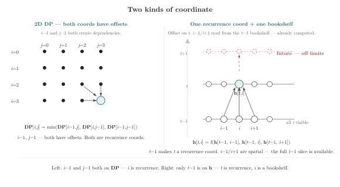

# Chapter 6 · The Arrow in the Bracket

> "Time is what keeps everything from happening at once."
>
> — Attributed to John Archibald Wheeler

*Combinations · The minus sign makes the arrow*

---

A coordinate that only appears as itself is a bookshelf. You can pull any book off any shelf in any order. Shelf 3 doesn't depend on shelf 2. The name doesn't matter — call it `i`, `j`, `k`, it's still a bookshelf as long as you never write `i-1` on the right-hand side.

A coordinate that appears with an offset is a novel. Page 50 can reference what happened on page 49. It cannot reference page 51 — page 51 hasn't been written yet. The name doesn't matter either — if you write `state[i-1]`, then `i` is a novel, whether you called it `i` or `t`. The offset is not a convention. It is a constraint, and violating it produces nonsense.

Everything you have done so far assumed all positions exist at once. Now meet the coordinate that appears with a minus sign.



On the left, both `i` and `j` appear with offsets — both are novels. Every cell reads from earlier positions in both directions. On the right, only `t` has an offset — `t` is a novel. `t+1` does not exist. `i` has no offset — at `t-1`, every `i` is a bookshelf, readable in any order. The minus sign is what the compiler checks.

---

## Not All Axes Are the Same

Look at this declaration:

```rust
u[t, i] = u[t-1, i] + f(u[t-1, i])
```

`t` and `i` are both written in brackets. The difference is not the name — it's the offset. `t` appears as `t-1` on the right-hand side. `i` never does.

In a spatial expression like `sum[i](A[i, k])`, `i` is just an index. You never write `i-1`. A coordinate that only appears as itself is concurrent — you sum over it, reduce along it, permute it — but you don't *recur* along it.

A coordinate that appears with an offset is different. `t-1` means step one depends on step zero, step two depends on step one. The offset makes `t` the direction of recurrence. Call it `t` or call it `step` — the minus sign is what matters.

---

## Recurrence Declarations

In Einlang, time is just another coordinate—but one that appears in index arithmetic. You declare it with a range:

```rust
let u[t in 0..T, i] = init_temp(i);
let u[t in 1..T, i] = u[t-1, i] + alpha * (
    u[t-1, i+1] - 2.0 * u[t-1, i] + u[t-1, i-1]
);
```

The first clause defines `u` at `t=0`—the initial condition. The second clause defines `u` at every subsequent time step in terms of the previous step. `t-1` is a backward reference: the value at time `t` depends on the value at time `t-1`.

This is a recurrence. The coordinate `t` carries time's directional structure into the notation. You cannot write `u[t+1, i]` to define `u[t, i]`—that would be a forward reference, and it is rejected as a static error. Causality is not a comment. It is a syntactic constraint. If the index expression references an index greater than or equal to the declared index, it is a static error. This is not philosophy. It is subtraction: `t-1 < t`, valid; `t+1 > t`, rejected.

How does the compiler know? It does a mechanical scan. For every read of the declared variable in the body, at every coordinate position, it asks one question: **is this index expression exactly the loop variable?** If yes — no dependency, the coordinate is a bookshelf at this read. If no — the coordinate carries a dependency, it is a recurrence coordinate at this read. One question per position per read. That's it.

Walk through `u[t-1, i] + alpha * (...)` with the declaration `u[t in 0..T, i]`. The compiler finds one read of `u` in the body: `u[t-1, i]`. At position 0, the expression is `t-1`. Is `t-1` exactly the loop variable `t`? No. Recurrence on dim 0. At position 1, the expression is `i`. Is `i` exactly the loop variable `i`? Yes. Not recurrence on dim 1. Result: dim 0 is recurrence, dim 1 is concurrent. The minus sign triggers it. No annotation. No `@recurrence`. The structural fact is in the code. The compiler derives it.

The declaration bracket names *what* is being defined and the domain of the recurrence coordinate. The body says *how*. The separation keeps the declaration side simple and declarative, while the body can use arbitrary index arithmetic:

```rust
let fib[0] = 0;
let fib[1] = 1;
let fib[n in 2..8] = fib[n-1] + fib[n-2];
```

The recurrence index range `n in 2..8` goes in the declaration bracket—it defines the domain. The expressions `n-1` and `n-2` go in the body—they compute the value by referencing earlier elements. Every reference must point strictly backward.

Now look at this line:

```rust
let h[t in 0..T] = step(h[t+1], x[t])
```

What should happen? The declaration says `t in 0..T`—the statement defines `h` at time `t`. The body references `h[t+1]`—a value at time `t+1`. At the moment `h[t]` is being computed, `h[t+1]` has not been computed yet. `t+1` is strictly greater than `t`. The rule: **every index reference to the declared variable must be strictly less than the declared index.** `t+1 < t` is false. Error.

The check does not need to know that `t` is "time." It does not need to know what "causality" means. It does exactly one thing: compare the reference index against the declared index, for every reference to the declared variable in the body. Reference index `<` declared index? Valid. Otherwise? Rejected. The coordinate can be called `t`, `x`, or `spatial_index`—the check is the same. Causality is not a name-declared property. It is subtraction.

This has a consequence that coordinates without offsets don't require. Only the steps that are actually referenced backward need to be kept. If every step references only `t-1`, the storage needed is a rolling window of size 2, regardless of whether `T` is 100 or 100,000. This follows mechanically from the backward references—no annotation needed.

---

### Be the Compiler

You now know what the compiler knows. For each fragment below, run the same mechanical scan. Find every read of the declared variable. Check each index expression against the loop variable. Then apply the causality rule: reference index `<` declared index.

Here are four fragments:

**Fragment A:**
```rust
let u[t in 0..T, i] = u[t-1, i] + u[t-2, i];
```

**Fragment B:**
```rust
let h[t in 0..T, i] = h[t-1, i] + x[t, i-1];
```

**Fragment C:**
```rust
let v[t in 0..T] = v[t+1] + v[t-1];
```

**Fragment D:**
```rust
let x[t in 0..T] = f(x[t-1]) + g(x[t]);
```

---

Here is what the compiler decides:

**Fragment A: passes.** `t-1 < t` and `t-2 < t`. Both references are strictly backward. Window size: 2 (references `t-1` and `t-2`).

**Fragment B: passes.** `t-1 < t` — the RHS reads `h` at `t-1`, so `t` is a recurrence coordinate. But `x[t, i-1]` reads a different variable `x` — the offset `i-1` does not make `i` a recurrence coordinate because the check only applies to the variable being defined. `t-1 < t` is true. Fragment B passes.

Yes. The causality check applies to the recurrence coordinate `t`. `x[t, i-1]` is just a spatial read of an input — `x` was fully computed before this clause runs. `i-1` is a spatial offset, not a recurrence. Fragment B passes.

But notice: `x[t, i-1]` means the computation at position `i` reads position `i-1` from `x` at the same time `t`. If the spatial iteration goes left to right, this is fine—`x[i-1]` is already available. If the spatial iteration goes right to left, `x[i-1]` hasn't been loaded yet. The compiler doesn't check spatial order by default because spatial coordinates don't carry a direction constraint. If you want spatial causality, you declare the coordinate with an offset on the declared variable.

**Fragment C: REJECTED.** `t+1 > t`. This is a forward reference on the recurrence coordinate. The body references a value at `t+1`, which hasn't been computed yet (assuming forward iteration). Error.

**Fragment D: REJECTED.** `x[t]` references the same step being defined. `t < t` is false. A value at time `t` cannot depend on itself—that would be a circular definition. The reference index must be strictly less than the declared index. `t < t` is not strict.

Three of four fragments caught by one rule: reference index `<` declared index. The spatial offset in Fragment B doesn't trigger the rule because the offset is on a different variable — `x[i-1]`, not `h[i-1]`. Only offsets on the declared variable create recurrence. The rule is simple. The check is mechanical.

---

## The Optimizer as a Recurrence

Training a model is a recurrence over time:

```rust
let w[t in 0..T, out, feature] = init_random(out, feature);
let w[t in 1..T, out, feature] = w[t-1, out, feature] - lr * grad[t-1, out, feature];
```

At `t=0`, `w` is the random initialization. At each subsequent step, `w` is the previous `w` minus a gradient step. The recurrence reads backward in time (`t-1`). The time coordinate `t` makes the training trajectory explicit. You can inspect `w[10, out, in]` to see the weights after 10 steps. You can compute `w[T-1, out, in] - w[0, out, in]` to see the total change. The time dimension is not hidden inside a mutable variable—it is a coordinate like any other.

A full training step:

```rust
let logits[t, b, class] = model(x[t, b, feature], w[t, out, feature]);
let loss[t, b] = cross_entropy[class](logits[t, b, class], labels[t, b]);
let grad[t, out, feature] = @loss[t, b] / @w[t, out, feature];
let w[t+1, out, feature] = w[t, out, feature] - lr * grad[t, out, feature];
```

The time coordinate `t` threads through forward, loss, gradient, and update. Every tensor knows its temporal position. The gradient `@loss[t] / @w[t, out, feature]` is explicitly anchored to time step `t`. The optimizer step defines `w[t+1]` in terms of `w[t]` and `grad[t]`.

There is a quieter distinction at work here that deserves explicit attention: **parameters versus hyperparameters.** Both are `let` bindings. Both are immutable values in scope for subsequent code. But they have different roles in the optimization story:

```rust
let weight: [f32; out, feature] = init_random(out, feature);
let learning_rate: f32 = 0.001;
```

`weight` is a parameter—its value changes during training, driven by gradients. Each coordinate on `weight` tells the optimizer something: `out` names the output neurons, `in` names the input connections. A weight decay regularizer that treats all elements uniformly can apply without coordinate awareness, but a per-neuron regularization policy needs to know which axis is `out` and which is `in`.

`learning_rate` is a hyperparameter—it controls the optimizer's behavior but is not itself updated by gradients. It carries no coordinate names because it has no coordinate structure.

This distinction is not a language feature. It is a naming discipline. But the discipline is only possible because the language provides a place to put the coordinate names. Without named axes, the optimizer sees `(128, 64)` and cannot distinguish `out` from `in`.

---

## An Axis with an Offset Has a Direction

A coordinate that only appears as itself has no dependencies — all positions exist concurrently. A coordinate that appears with an offset on the RHS has a dependency. `t-1` means `t` depends on the previous step. Not concurrency. Dependency.

This distinction has consequences. A coordinate with an offset carries two properties that a coordinate without one doesn't:

1. **Causality**: every offset reference to the declared variable must be strictly less than the declared index. `t-1` is valid. `t+1` is a compile error.
2. **Memory**: only the steps that are actually referenced backward need to be kept in memory. If every step references only `t-1`, the storage needed is a rolling window of size 2, regardless of whether T is 100 or 100,000. This follows mechanically from the backward references—no annotation needed.

---

## Bidirectional Recurrence

Not all recurrences look only to the past. A bidirectional RNN reads the sequence both ways:

```rust
let h_forward[t in 1..T, i] = step(h_forward[t-1, i], x[t, i]);
let h_backward[t in 0..T-1, i] = step_back(h_backward[t+1, i], x[t, i]);
```

The forward recurrence reads `t-1`—standard. The backward recurrence reads `t+1`—the future from the perspective of `t`. This is still valid because the backward recurrence iterates from right to left: `t` runs from `T-1` down to `0`, so `t+1` is always already computed. The direction of iteration determines which references are "backward."

The same coordinate domain, two different iteration directions, one linguistic mechanism. The declaration bracket names the domain and direction. The body states the dependency. Consistency is checked.

Notice when someone writes this:

```rust
let h[t in 0..T, i] = step(h[t+1, i], x[t, i]);
```

No iteration direction declared. Just `t in 0..T`. The body references `t+1`. Is this valid or not?

It depends on whether the compiler infers the iteration direction from the reference pattern. If `t+1` references a time step that hasn't been computed yet (because iteration goes left to right), this is a forward reference and should be rejected. But if the compiler can infer that `t` should iterate from `T` down to `0`—making `t+1` already computed—it could be valid.

The Einlang rule is conservative: without an explicit reverse-direction declaration, forward references are rejected. `t+1` with `t in 0..T` is an error. The programmer must write `t in T..0` (or equivalent syntax) to declare the reverse iteration. The tool prevents the ambiguous case by default.

This is the same design choice as Chapter 3's Coordinate Contract and Chapter 5's Pack Resolution: when a reference pattern is ambiguous, the language requires the programmer to disambiguate. Default deny. Explicit allow.

---

## The Rolling Window: What Causality Buys

Causality is not just a correctness check. It is a memory optimization.

When a recurrence body only references `t-1`, the compiler knows that only one previous time step is needed. It can allocate a rolling window of size 2 rather than storing the entire `(T, ...)` tensor in memory. When `T` is 100,000, this is the difference between allocating gigabytes and allocating megabytes.

This optimization follows mechanically from the backward references. The compiler scans the body for time-indexed references. Every reference to `t - k` (positive `k`) requires storing `k` previous steps. The rolling window size is `max(k)`. No annotation needed. The coordinate names and index arithmetic carry enough information for the compiler to derive the memory plan.

The same principle—coordinate set subtraction—is at work. The output coordinate set includes `t`. The body references `t - k`. The difference `t - (t - k) = k` tells the compiler how many previous steps to store. Set subtraction, introduced in Chapter 2 for broadcast detection, applied here to memory planning. The operation is the same. The application is different.

Consider a second-order recurrence:

```rust
let u[t in 2..T, i] = u[t-1, i] + 0.5 * (u[t-1, i] - u[t-2, i]);
```

References: `t-1` and `t-2`. Maximum offset: 2. Rolling window size: 3 (current, t-1, t-2). The compiler derives this from the index expressions. No `@roll_window(3)` annotation. The information is in the code, not in a compiler directive.

The programmer writes `t-2`. The compiler derives window size 3. The programmer writes `sum[class]`. The compiler derives `axis=1`. The programmer writes `bias[j]` omitting `i`. The compiler derives the backward-pass sum over `i`. Source records intent. Compiler derives execution.

---

### Three Declarations, Three Storage Schemes

The same recurrence declaration leads to different storage strategies depending on what the programmer references. The compiler reads the references and derives the strategy. Three scenarios:

**Scenario 1: Rolling window.** `u[t] = f(u[t-1])`. References: `t-1` only. Window size: 2 (one past step plus current). Storage: two arrays. The compiler allocates `u_prev` and `u_curr`, swaps them after each step. No allocation proportional to `T`.

**Scenario 2: Full materialization.** `u[t] = f(u[t-1])` followed by `mean[t](u[t, i])`. The entire time trajectory is needed for the final mean over `t`. The compiler sees that `t` is consumed by a reduction after the recurrence, so all time steps must be kept. Storage: full `(T, ...)` tensor.

**Scenario 3: Strided observation.** `u[t] = f(u[t-1])` followed by `u[0], u[10], u[20], ...` (every 10th step). The compiler sees that only `u[k*10]` is used downstream. Storage: rolling window of size 10, with the current and last 9 steps buffered. At each multiple of 10, the current value is written to persistent storage and the buffer recycles.

In all three scenarios, the declaration is the same: `let u[t in 0..T, i] = f(u[t-1, i])`. The difference is in what downstream code does with `u`. The compiler reads the downstream uses and derives the storage strategy. No annotation. The structural fact is in the code. The compiler derives the engineering consequence.

The recurrence body records the dependency — the compiler found it by scanning for offsets. The downstream uses record the observation pattern. The compiler connects them. One scan, two purposes: correctness (causality check) and memory (window size). Both from the same minus sign.

The compiler reads the code the way a reader reads a story: forward to understand what each step depends on, backward to determine what must be kept. The same declaration can compile to two arrays or a full trajectory tensor. The difference is not in the declaration. It is in what the code goes on to demand.

---

## Time in the Training Loop

The optimizer recurrence from earlier is worth tracing step by step:

```rust
// Step 0: random initialization
let w[0, out, feature] = init_random(out, feature);

// Step 1: forward pass
let logits[1, b, class] = model(x[1, b, feature], w[0, out, feature]);
let loss[1, b] = cross_entropy[class](logits[1, b, class], labels[1, b]);

// Step 1: backward pass
let grad[1, out, feature] = @loss[1, b] / @w[0, out, feature];

// Step 1: update
let w[1, out, feature] = w[0, out, feature] - lr * grad[1, out, feature];

// Step 2: forward pass
let logits[2, b, class] = model(x[2, b, feature], w[1, out, feature]);
// ... and so on
```

At each time step, three things happen: forward (model produces output), backward (gradient is computed), update (weights move against the gradient). The time index `t` is explicit on every tensor. You can read the value of `w` after any step. You can read the loss at any step. The training trajectory is a tensor, not a sequence of in-place mutations.

Now compare to the PyTorch equivalent:

```python
w = init_random(out, in)
for t in range(1, T):
    logits = model(x[t], w)
    loss = cross_entropy(logits, labels[t])
    loss.backward()
    with torch.no_grad():
        w -= lr * w.grad
```

`w` is a single mutable tensor. `loss` is a scalar. The time dimension is the loop variable `t`—visible in the Python control flow but absent from the tensor structure. You cannot inspect `w[10]` without checkpointing the value at step 10 yourself. The training trajectory exists in execution time, not in the type system.

The Einlang version makes the training trajectory a data structure. The PyTorch version makes it a side effect. The difference is whether you can query the past.

---

## Diffusion Models

Diffusion models add noise over `T` timesteps and learn to reverse it. The time coordinate appears in two roles: recurrence index for the sampling chain, and conditioning signal for the denoising network.

```rust
let x[t in 0..T, b, c, h, w] = ...;
let x[t in 1..T, b, c, h, w] = sqrt(1 - beta[t]) * x[t-1, ...] + sqrt(beta[t]) * eps[t, ...];
```

The schedule `beta[t]` is indexed by `t`, making the dependency visible. In the backward pass:

```rust
let x_hat[t in T..1, b, c, h, w] = denoise(x[t, ...], t, model(x[t, ...], t));
```

The iteration runs backward. The model receives `t` as conditioning. This is the same mechanism that carried `class` through `softmax[class]` in Chapter 3, applied to a coordinate with an offset. The direction—forward or backward—is the only difference.

A coordinate with an offset carries a direction constraint. The constraint is checked. The coordinate flows through functions. The training loop is a recurrence. The diffusion process is a recurrence. The optimizer is a recurrence. Three domains, one mechanism.

---

---

## The Gradient of a Recurrence

Recurrences have gradients. And because recurrences are self-referential—each step depends on the previous step—the gradient must flow backward through time. This is Backpropagation Through Time (BPTT), and its coordinate structure is the same recurrence, read in reverse.

Forward: `h[t] = step(h[t-1], x[t])`. The output `h[t]` depends on `h[t-1]`, which depends on `h[t-2]`, and so on back to `h[0]`.

Backward: the gradient `d_loss/d_h[t]` must propagate to `d_loss/d_h[t-1]`, then to `d_loss/d_h[t-2]`, and so on. At each step, the gradient flows through the `step` function's Jacobian with respect to `h[t-1]`. The backward recurrence:

```rust
let d_h[t in T..0] = @loss[t] / @h[t] + @step(h[t], h[t-1], x[t]) / @h[t] * d_h[t+1];
```

The backward recurrence runs from `T` down to `0`, referencing `t+1` (the future in the backward direction, which has already been computed). This is the same bidirectional mechanism from Section 6, applied to the gradient. The coordinate `t` still carries the causality constraint, but the iteration direction has reversed.

In Einlang, the backward recurrence is generated from the forward recurrence by the same Inversion Rule that governs reductions and broadcasts: `t in 1..T` forward becomes `t in T..0` backward. The coordinate names stay the same; the compiler generates the backward loop from the forward declaration.

Time was one coordinate with a direction. Chapter 7 enters terrain where one coordinate splits into two roles: `point` becomes `point_i` and `point_j` in a distance matrix, `sample` becomes `anchor` and `positive` in contrastive learning. Convolution adds index arithmetic (`oh + kh`). Fancy indexing asks whether `k` in two places means pairwise or outer-product—and the names answer. The split is the operation. The names record it.
