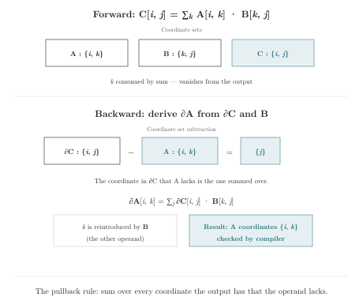

# Chapter 8 · Names Through Differentiation

> "In the forward pass, you eliminate information. In the backward pass, you guess."

*Combinations · Automatic differentiation and the pullback*

---

You've been computing gradients all week. `loss.backward()` handles them. You don't think about them. Then you write a custom backward pass — a `torch.autograd.Function` or a manual gradient check — and suddenly you're staring at a sum over the wrong axis, wondering which coordinate you missed.

The autograd engine computes gradients by tracing the forward pass and inverting each operation. When you write the backward pass by hand, you are the engine. And the engine's hardest question is: *over which coordinates do I sum?*

The answer is always the same. It's the Inversion Rule from Chapter 2, applied to every operation in the forward graph: forward broadcast becomes backward reduction, forward reduction becomes backward broadcast. This chapter shows that the five-step pullback — the procedure for deriving any gradient by hand — is coordinate set subtraction, applied in reverse.

---

## The Shopping Cart and the Restocking Run

An intuition model:

You are writing the backward pass for a custom layer. The forward code is in front of you:

```rust
let C[i, j] = sum[k](A[i, k] * B[k, j]);
```

You have `dC[i, j]`—the gradient of the loss with respect to `C`. You need `dA[i, k]`. You don't want to look up the formula. You don't want to memorize the transpose rule. You just want to derive it from what the forward code says.

Start from first principles. `A[i, k]` appears exactly where? Inside the `sum[k]`: it is multiplied by `B[k, j]` and then summed over `k`. For a specific element `A[i0, k0]`, which output cells does it contribute to? Every output cell where `i = i0` AND the sum includes `k = k0`. That means `C[i0, j]` for *all* `j`.

So `A[i0, k0]` sends a contribution `A[i0, k0] * B[k0, j]` to `C[i0, j]`. The gradient signal `dC[i0, j]` must flow back along that same path. The local derivative of `A[i, k] * B[k, j]` with respect to `A[i, k]` is `B[k, j]`. So the contribution from output cell `C[i0, j]` back to `A[i0, k0]` is `dC[i0, j] * B[k0, j]`.

Now sum over all the output cells that received a contribution. Those are all `j` positions. The coordinate `j` is in `C` but NOT in `A`. Sum over it:

```rust
let dA[i, k] = sum[j](dC[i, j] * B[k, j]);
```

You just derived the matmul pullback. You didn't memorize it. You didn't look it up. You did coordinate accounting: which coordinates does the output have that the operand doesn't? Sum over those.

What just happened: tracing which coordinates were "paths" from `A` to `C`. The coordinate `j` was a path—every output position along `j` received input from `A[i0, k0]`. To send the gradient back, you had to sum over that path. The coordinate `k` was consumed by the forward sum—it existed in `A` and was eliminated. The backward pass doesn't need to sum over `k` because `A[i, k]` only contributed to `C[i, j]` through the specific `k` value in the sum. Each `k` position's gradient is independent.

Here is the pattern. In the forward pass, some coordinates are *consumed*—a reduction (`sum[k]`) eliminates them. Some coordinates are *silent*—a broadcast copies a value along them without the value depending on them. In the backward pass, every consumption becomes a broadcast (the gradient must be spread back over what was consumed) and every silence becomes a reduction (all the copies must be collected).

The forward pass is shopping; the backward pass is restocking the same receipt in reverse.

---

## The Gradient as Coordinate Subtraction

The general rule:

`@loss / @W` has the same shape as `W`. The coordinates on the gradient result are exactly the coordinates on the denominator.



The path from `W` to `loss` eliminates every coordinate that `W` carries. The gradient reconstructs those eliminations in reverse.

The pullback rule in one sentence: **the gradient sums over the set-difference of coordinates between the output and the operand.** Output has `{i, j}`. Operand `A` has `{i, k}`. Difference: `{j}`. Sum over `j`. The missing coordinate `k` is provided by the other operand `B[k, j]`.

Coordinate accounting. No transpose rules. No memorization.

---

## The Five-Step Pullback Procedure

Before reading the procedure, try it yourself. Forward: `C[i, j] = sum[k](A[i, k] * B[k, j])`. You have `dC[i, j]` — the gradient of the loss with respect to `C`. You want `dA[i, k]`. Which output cells does `A[i0, k0]` contribute to? What's the local derivative? Which coordinate must you sum over?

Given a forward expression and a target operand, derive the gradient:

1. **Hold one cell** of the target operand. Choose a specific element—say `A[i0, k0]`.
2. **List every output cell that reads it.** For `C[i, j] = sum[k](A[i, k] * B[k, j])`, the held cell is read by every output where `i = i0` and the sum includes `k = k0`. That means `C[i0, j]` for *all* `j`.
3. **Attach the incoming gradient.** Each output cell `C[i0, j]` carries a gradient signal `dC[i0, j]`. The contribution from the path through `A[i0, k0]` is `dC[i0, j] * B[k0, j]`.
4. **Multiply by the local derivative.** For elementwise multiplication inside the sum, the local derivative of `A[i, k] * B[k, j]` with respect to `A[i, k]` is `B[k, j]`.
5. **Sum the routes.** The path coordinate—the coordinate in `C` but not in `A`—is `j`. Sum over it.

> **Path coordinate.** A coordinate is a *path coordinate* for an operand if it appears in the output of a forward computation but does not appear in that operand's index pattern. The gradient with respect to that operand sums over all of its path coordinates. Formally: `paths(operand, output) = {coordinates in output} ∖ {coordinates in operand}`.

The result: `dA[i, k] = sum[j](dC[i, j] * B[k, j])`. No calculus memorization. No transpose rules. Just coordinate accounting.

---

### The Pullback in One Example

Observe the five steps on a broadcast-add. Forward:

```rust
let out[i, j] = A[i, j] + bias[j];
```

Given `d_out[i, j]`, find `d_bias[j]`. What coordinates does the output have? `{i, j}`. What coordinates does `bias` have? `{j}`. The path coordinate (in output but not in bias) is `{i}`. Sum over `{i}`.

1. Hold one cell: `bias[j0]`.
2. Every output cell reads it: `out[i, j0]` for *all* `i`. The held `j0` value is copied to every `i` position.
3. Attach the incoming gradient: each output cell carries `d_out[i, j0]`. The contribution from the path through `bias[j0]` is `d_out[i, j0] * 1` (the local derivative of `x + bias` wrt `bias` is 1).
4. Local derivative: 1.
5. Sum over the path coordinates: output has `{i, j}`, bias has `{j}`. Difference: `{i}`. Sum over `i`.

Result: `d_bias[j] = sum[i](d_out[i, j])`. The broadcast coordinate `i` becomes the reduction coordinate. The Inversion Rule, mechanically applied.

Verify with coordinate set subtraction alone. Forward: `out[i, j] = A[i, j] + bias[j]`. `out` has `{i, j}`, `bias` has `{j}`. Set difference: `{i}`. Sum over `{i}`. `d_bias[j] = sum[i](d_out[i, j])`. ✓

The pattern: the gradient sums over whatever is in the output but not in the operand. Five steps. No calculus memorization. The coordinate sets tell you what to sum over. The forward expression tells you what to multiply by.

---

## Convolution Gradients

A convolution is a sum of products with index arithmetic:

```rust
let conv[b, oc, oh, ow] = sum[ic, kh, kw](
    input[b, ic, oh + kh, ow + kw] * weight[oc, ic, kh, kw]
);
```

The gradient with respect to `weight` sums over everything that `weight` does not own:

```rust
let dW[oc, ic, kh, kw] = sum[b, oh, ow](
    dConv[b, oc, oh, ow] * input[b, ic, oh + kh, ow + kw]
);
```

The coordinates `b`, `oh`, `ow` are summed away because they appear in the output but not in `weight`. The coordinates `oc`, `ic`, `kh`, `kw` survive because they *are* `weight`'s coordinates.

Again: set subtraction. The formula is mechanically derivable from the coordinate sets. The same five steps produce the weight gradient with the correct index arithmetic.

**Derive it yourself: The weight gradient.** The linear layer is `z[b, out] = sum[in](x[b, in] * W[out, in]) + bias[out]`. You derived `d_bias[j]` above by coordinate set subtraction. Now derive `dW[out, in]`.

Apply the five steps. The output `z[b, out]` has coordinates `{b, out}`. The operand `W[out, in]` has coordinates `{out, in}`. Path coordinates in the output but not in `W`: `{b}`. But `W` also has `in`, which the output does not have—because `in` was consumed by the forward `sum[in]`. Consumed coordinates survive in the weight gradient. The path coordinates to sum over are `{b}`—the coordinate `W` was silent on in the forward pass.

Before reading further, write the answer. Then verify: does your `dW` have coordinates `{out, in}`? Does the sum go over `{b}`?

```
dW[out, in] = sum[b](dZ[b, out] * x[b, in])
```

The sum is over `b`—the coordinate `W` broadcasts over. `in` survives because each `in` position gets an independent gradient contribution through the forward sum. `out` survives because it is shared with the output. Two coordinates survive. One is summed away. The five steps, mechanically applied. You didn't memorize the formula. You read it off the coordinate sets.

---

## The Broadcast Self-Audit

A forward broadcast makes a promise. A backward gradient collects dependence. If the two disagree, the gradient is silently wrong.

Consider a linear layer with a bias:

```rust
let z[b, out] = sum[in](x[b, in] * W[out, in]) + bias[out];
```

The bias term omits `b`—it promises that the bias does not depend on the batch element. Now compute the gradient:

```rust
let d_bias[out] = sum[b](d_loss[b, out]);
```

The gradient sums over `b`. Why? Because in the forward pass, `bias[out]` was replicated across every batch element. Every batch element carries a piece of the gradient signal. To update `bias`, collect all those pieces. The omitted coordinate becomes the reduced coordinate in the backward pass.

Three questions for any broadcast:

1. **What coordinate am I broadcasting over?** Is the name visible in the code, or is it inferred from position?
2. **Is independence truly justified?** Does the broadcast value genuinely not depend on that coordinate?
3. **What will the gradient do?** Does the backward reduction produce the right shape for the parameter update?

These three questions are the broadcast self-audit. They catch the class of bugs where a broadcast is shape-correct but semantically wrong.

---

## Custom Differentiation with `@fn`

Some functions have derivatives that are better expressed directly:

```rust
fn relu(x) { if x > 0.0 { x } else { 0.0 } }

@fn relu(x) {
    if x > 0.0 { @x } else { 0.0 }
}
```

The `@fn` declaration shares the function's name and parameter list. Inside the body, `@x` refers to the tangent flowing through parameter `x`. Custom rules can be coordinate-aware:

```rust
@fn softmax[j](x: [f32; ..left, j, ..right]) {
    softmax_tangent[j](x, @x)
}
```

The coordinate parameter `j` appears in both the primal function and its derivative rule. The tangent computation follows the same coordinate contract as the primal.

---

## Where Clauses in the Backward Pass

A where clause acts as a gate in both directions:

```rust
let pos_sum = sum[i](data[i]) where data[i] > 0;
```

In the forward pass, only positive elements are summed. In the backward pass, the gradient signal is distributed only to the positive elements. Elements that were filtered out receive zero gradient. You don't write a separate backward filter. The where clause defines the domain of the operation, and the domain applies in both directions.

The where clause is the gate. Items that pass the condition in the forward pass receive gradient in the backward pass. Items that don't, don't. The condition is written once.

The most common where clause in practice: masked softmax. You have a sequence with padding. The logits for padding positions should be ignored—both in the forward pass (they should not contribute to the sum) and in the backward pass (they should receive zero gradient):

```rust
let probs[b, j] = softmax_over_valid[class](logits[b, class])
    where valid[b, class];
```

The `valid[b, class]` tensor is a boolean mask—`true` for real tokens, `false` for padding. The where clause gates every operation inside `softmax_over_valid`: the max reduction, the subtraction, the exponentiation, the sum reduction, and the division. Five operations. One gate.

In PyTorch, you'd write a custom masked softmax, or add `float('-inf')` to masked positions before the softmax, or use `torch.where` after the softmax to zero out padding. Each approach has its own backward behavior. The `-inf` trick works for softmax but not for mean. The `torch.where` approach leaves non-zero gradients on padding positions (they were computed, then zeroed—waste). The custom function is correct but requires writing a custom backward pass.

The where clause avoids all three. The gate is part of the operation's domain. The compiler reads it once, applies it to every operation inside the reduction, and generates both the forward gating and the backward gating. No custom backward code. No `-inf` hack. No wasted computation. The gate is written where it belongs—in the domain specification of the operation it gates.

Now a harder one. What if the where clause references a coordinate that is consumed by the operation?

```rust
let top_sum[b] = sum[class](logits[b, class]) where logits[b, class] > threshold[b];
```

The where clause references `class`—the coordinate being consumed by `sum`. The condition `logits[b, class] > threshold[b]` is a tensor of shape `(batch, class)`. Each `(b, class)` position has a boolean gate.

In the backward pass, the gradient signal `d_top_sum[b]` is distributed back to `logits[b, class]`—but only to positions where the gate was open. For each `b`, elements of `class` that were below `threshold[b]` receive zero gradient. The where clause is evaluated during the forward pass and its boolean mask is stored. The backward pass reads the mask and gates the gradient accordingly.

No separate backward code. No custom `@fn` rule. The where clause is part of the reduction's domain specification, and the compiler generates both the forward gating and the backward gating from it. The coordinate names in the condition—`class` in this case—tell the compiler which dimension the gate applies to.

---

## LayerNorm: A Complete Gradient Walkthrough

Tracing the gradient of LayerNorm end to end:

Forward pass:

```rust
fn layer_norm[feature](x: [f32; ..batch, feature],
                      gamma: [f32; feature],
                      beta: [f32; feature])
    -> [f32; ..batch, feature]
{
    let mean_val[..batch] = mean[feature](x[..batch, feature]);
    let centered[..batch, feature] = x[..batch, feature] - mean_val[..batch];
    let var[..batch] = mean[feature](centered[..batch, feature] ** 2.0);
    (centered[..batch, feature] / (var[..batch] ** 0.5 + 1e-5)) * gamma[feature] + beta[feature]
}
```

`d_out[..batch, feature]` is the gradient of the loss with respect to the LayerNorm output. Compute `dx[..batch, feature]`, `d_gamma[feature]`, and `d_beta[feature]`.

**Step 1: Gradient of beta.** The output expression ends with `+ beta[feature]`. This is an elementwise addition. `beta` omits `..batch` in its index pattern—it broadcasts over all batch dimensions. By the Inversion Rule, the gradient sums over the broadcast set:

```rust
let d_beta[feature] = sum[..batch](d_out[..batch, feature]);
```

`d_out` has `{..batch, feature}`. `beta` has `{feature}`. Difference: `{..batch}`. Sum over it. Result: `{feature}`, matching `beta`'s shape.

**Step 2: Gradient of gamma.** Same pattern. `gamma[feature]` broadcasts over `..batch`. The gradient sums over `..batch`:

```rust
let d_gamma[feature] = sum[..batch](
    d_out[..batch, feature] * centered[..batch, feature] / (var[..batch] ** 0.5 + 1e-5)
);
```

The local derivative of `gamma * x_norm` with respect to `gamma` is `x_norm`. Multiply by the incoming gradient. Sum over the broadcast set. Done.

**Step 3: Gradient of x.** This is the complex one—`x` contributes to the output through three paths: directly through `centered` (which contains `x`), and indirectly through `mean_val` and `var` (which were computed from `x`). But the coordinate accounting still works: `x` has `{..batch, feature}`. The output has `{..batch, feature}`. No coordinate difference. The gradient must have the same shape. No sum—the contributions from all three paths accumulate at each `(..batch, feature)` position.

Coordinate set subtraction tells you *which* coordinates get summed. The local computation tells you *what* to sum. Together they produce the gradient without shape memorization.

---

## The Pullback as Coordinate Set Subtraction: A Summary

Every pullback you have seen follows the same rule. Given a forward expression and the operand whose gradient you want:

1. Write the operand's coordinate set. `A` has `{i, k}`.
2. Write the output's coordinate set. `C` has `{i, j}`.
3. The path coordinates = output set minus operand set. `{j}`.
4. Sum over the path coordinates. `dA[i, k] = sum[j](...)`.

The other operand (`B[k, j]`) provides the missing coordinate `k`. The local derivative comes from differentiating the forward operation with respect to the operand. The path-sum structure comes from the coordinate sets.

This is the pullback rule as coordinate accounting. No transpose rules memorized. No Jacobian dimensions counted. Just set subtraction, applied to coordinate names.

In a single equation—carry this with you:

```
dA = Σ_{paths(A, C)}  dC · ∂(forward)/∂A

where paths(A, C) = {coordinates in C} ∖ {coordinates in A}
```

`paths(A, C)` is the set of coordinates in the output `C` that are NOT in the operand `A`. Sum over them. Multiply by the local derivative. Done. It is the formula behind every gradient derived from a tensor expression. The rest is accounting.

---

The gradient is not a separate computation from the forward pass. It is the forward pass, read backward. The coordinate names that organize the forward pass—which survive, which are consumed, which are omitted—organize the backward pass in exactly the same way. A coordinate eliminated by a forward sum becomes a coordinate introduced by a backward broadcast. A coordinate omitted by a forward broadcast becomes a coordinate summed by a backward reduction.

The names are the same. The direction is reversed. The principle is symmetric.

---

## The Gradient of a Coordinate-Aware Function Call

When a function call appears in the forward pass, its backward pass is determined by the function's coordinate contract. The gradient does not need to re-verify the contract—the forward call already did. The gradient only needs to apply the Inversion Rule to each primitive operation inside the function body.

Consider `softmax[class](logits)`. Forward: the function body contains `max[class]`, `sum[class]`, elementwise operations, and a division. Backward: `max[class]` becomes a broadcast (only the argmax position receives the gradient), `sum[class]` becomes a broadcast (every summed element receives the gradient), the division's gradient is elementwise.

The coordinate `class` is the reduction axis in both `max` and `sum`. The backward pass broadcasts over `class` for both. The gradient flows through the function's coordinate parameter—`class` in, `class` out. The caller never sees the internal backward operations. The coordinate contract at the call site guarantees that `class` exists on the input, so the gradient exists on the same coordinate.

A custom `@fn` rule for softmax overrides this automatic derivation—but the coordinate parameter in the custom rule must match the primal. The compiler checks this:

```rust
fn softmax[j](x: [f32; ..left, j, ..right]) -> [f32; ..left, j, ..right] { ... }

@fn softmax[j](x: [f32; ..left, j, ..right]) {
    // Custom backward: softmax_tangent[j](x, @x)
    // j must match the primal's coordinate parameter
}
```

If the custom rule declares `@fn softmax[k]` (different coordinate parameter name), the compiler reports a mismatch. If the custom rule returns a gradient with different coordinates than the primal's input, the compiler reports a mismatch. The coordinate contract extends from the forward pass into the backward pass. The same names, checked in both directions.


---

*Revisit the last gradient you debugged. Write the forward expression with coordinate names. Derive the backward expression using coordinate set subtraction. Does the backward sum match the forward broadcast? The answer to that question is the answer to whether your gradient was correct.*

---

### The Pullback in Practice

The five-step pullback procedure applies to matmul, broadcast-add, and sum-to-scalar. It also applies to convolution, normalization, and attention. The procedure is always the same: hold one cell, list every output cell that reads it, attach the incoming gradient, multiply by the local derivative, sum over the path coordinates.

A gradient written or debugged by hand—a custom backward pass, a `torch.autograd.Function`, a manual gradient check—is a forward expression read backward. Writing the forward expression with coordinate names, even if the original code is in PyTorch, makes the backward derivation mechanical. What coordinates does the output have? What coordinates does the operand have? What's the difference? Sum over the difference. No insight required. Coordinate set subtraction, applied to the forward expression, produces the backward sum.

When the derived gradient matches the original, the coordinate accounting confirms the manual derivation—both arrived at the same result through different paths. When they differ, either the coordinate accounting was wrong, or the original gradient was. Both possibilities are worth checking. The same procedure works for convolution, normalization, and attention. The coordinate sets are larger. The procedure doesn't change.

The pullback is not a separate computation from the forward pass. It is the forward pass, read backward, through the lens of the Inversion Rule. Every forward reduction becomes a backward broadcast. Every forward broadcast becomes a backward reduction. The coordinate names are the bridge between the two directions. The five steps are the procedure for crossing it.

The five-step pullback is coordinate accounting done by hand. But accounting is exactly what a compiler can do mechanically. Chapter 9 opens the compiler: how does it read names from source, check them against five rules, and lower them to integers—all without ever running the program? The answer turns out to be the same question you have been asking since Chapter 2: *which coordinates survive?*
