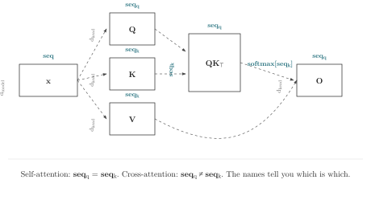

# Chapter 12 · Comparison: Attention

> "The difference between the right word and the almost right word is the difference between lightning and a lightning bug."
>
> — Mark Twain

*Comparisons · Self-attention, cross-attention, and multi-query attention in two notations*

---

You are writing an encoder-decoder Transformer. During development, source and target sequences happen to have the same length—64 tokens. Self-attention works. Cross-attention works. The code for both is a single positional function: `attention(Q, K, V, mask)`. The shapes match. The loss descends. You ship.

Six weeks later, a configuration change sets source length to 128, target to 64. The code still runs—broadcasting absorbs the shape mismatch. But your model now attends from every target position to every source position *twice*, silently. The BLEU score drops two points. You spend three days tracing the drop to a transposed mask broadcasting along the wrong axis. The Square Matrix Test, first encountered with softmax in Chapter 3, returns with a vengeance.

Here is the root cause: self-attention and cross-attention have identical positional code. Stop and let that sink in. Two operations—different semantics, different gradient flows, different architectural implications—expressed as the exact same Python function. The shapes differ at runtime. The source code does not. When source length equals target length, the two attentions are indistinguishable even at runtime. The coordinate names are different. The code is the same. Only the names can distinguish them.

Chapter 11 showed that the pattern holds for normalization—one reduction axis, four variants, one skeleton. Attention raises the stakes: five coordinates with distinct roles, three architectural variants whose positional code is textually identical, a runtime KV-cache whose correctness depends on which axis is concatenated. The question shifts from *does the pattern hold?* to *what does the pattern reveal that positional code cannot say?*

---

## Scaled Dot-Product Attention: The Skeleton

The core operation:

$$\text{Attention}(Q, K, V) = \text{softmax}\left(\frac{QK^T}{\sqrt{d}}\right)V$$

In Einlang, the coordinate names tell the story:

```rust
fn attention[seq_q, seq_k, head, d](
    Q: [f32; ..b, head, seq_q, d],
    K: [f32; ..b, head, seq_k, d],
    V: [f32; ..b, head, seq_k, d]
) -> [f32; ..b, head, seq_q, d]
{
    let scores[..b, head, seq_q, seq_k] =
        sum[d](Q[..b, head, seq_q, d] * K[..b, head, seq_k, d]) / (d ** 0.5);
    let weights[..b, head, seq_q, seq_k] = softmax[seq_k](scores[..b, head, seq_q, seq_k]);
    sum[seq_k](weights[..b, head, seq_q, seq_k] * V[..b, head, seq_k, d])
}
```

Three coordinates do all the work: `seq_q` (the query source sequence), `seq_k` (the key source sequence), and `d` (the inner dimension that gets contracted). `softmax[seq_k]` normalizes over the key sequence—each query position produces a distribution over key positions.

---

## Self-Attention vs. Cross-Attention

Self-attention uses the same sequence for queries and keys. Cross-attention uses different sequences—queries from the decoder, keys from the encoder.

**PyTorch (self-attention):**

```python
def self_attention(Q, K, V):
    d = Q.shape[-1]
    scores = torch.matmul(Q, K.transpose(-2, -1)) / (d ** 0.5)
    weights = torch.softmax(scores, dim=-1)
    return torch.matmul(weights, V)
```

**PyTorch (cross-attention):**

```python
def cross_attention(Q, K, V):
    d = Q.shape[-1]
    scores = torch.matmul(Q, K.transpose(-2, -1)) / (d ** 0.5)
    weights = torch.softmax(scores, dim=-1)
    return torch.matmul(weights, V)
```

They are identical. Two operations with different gradient flows and different architectural implications — textually identical. The distinction between them — whether `seq_q` equals `seq_k` — is not in the source code. It is in the shapes of the tensors passed at runtime. The notation records nothing.

**Einlang:**

```rust
// Self-attention: same coordinate for queries and keys
fn self_attention[seq, head, d](Q: [f32; ..b, head, seq, d], K: [f32; ..b, head, seq, d], V: [f32; ..b, head, seq, d])
    -> [f32; ..b, head, seq, d]
{
    attention[seq, seq, head, d](Q, K, V)
}

// Cross-attention: different coordinates for queries and keys
fn cross_attention[seq_q, seq_k, head, d](Q: [f32; ..b, head, seq_q, d], K: [f32; ..b, head, seq_k, d], V: [f32; ..b, head, seq_k, d])
    -> [f32; ..b, head, seq_q, d]
{
    attention[seq_q, seq_k, head, d](Q, K, V)
}
```

The distinction is in the type signatures. Self-attention uses `seq` for both queries and keys. Cross-attention uses `seq_q` and `seq_k`—two different coordinate names, potentially with different domain sizes. A reader can tell which is which without checking whether the tensors happen to have the same shape.

Here is the attention skeleton with every coordinate named:



Trace the arrows. `seq_q` rides Q into the scores and the output. `seq_k` rides K and V, and is consumed by `softmax[seq_k]` — it does not reach the output. `head` groups the attention heads. `d` is the inner dimension, contracted by `sum[d]` inside the scores. When `seq_q` and `seq_k` name the same sequence, the attention is self. When they name different sequences, it is cross. The diagram records the difference. The positional code for both is identical.

---

## The Square Matrix Test for Attention

When `seq_q == seq_k` and `head == some_other_dimension`, the attention matrix is square. The positional code for self-attention, cross-attention, and a transposed variant are numerically identical. Consider this bug:

```python
# Intended: cross-attention from decoder (seq_len=32) to encoder (seq_len=100)
# Bug: accidentally used the same tensor for Q and K
Q = decoder_hidden   # shape (batch, head, 32, d)
K = decoder_hidden   # bug: should be encoder_hidden, shape (batch, head, 100, d)
V = decoder_hidden
output = cross_attention(Q, K, V)  # silently becomes self-attention
```

If `decoder_hidden` and `encoder_hidden` happen to have the same sequence length during development (both 32, or both padded to the same length), this bug is invisible. The shapes match. The loss descends. The model learns—just not what you intended.

In Einlang, `cross_attention[seq_q, seq_k, ...](Q, K, V)` with `Q` and `K` both bound to `decoder_hidden` would trigger a coordinate mismatch if `decoder_hidden` has `seq_q` but not `seq_k` as its declared coordinate. If both tensors carry both coordinates (because they were declared with different names), the mismatch is caught at the call site.

---

## Multi-Query Attention (MQA)

MQA uses multiple query heads but only one key-value head, broadcasting the KV head across query heads. This is a performance optimization that changes the coordinate structure:

**PyTorch:**

```python
def mqa_attention(Q, K, V):
    # Q: (batch, head_q, seq_q, d)
    # K: (batch, 1, seq_k, d)      -- single KV head
    # V: (batch, 1, seq_k, d)
    d = Q.shape[-1]
    scores = torch.matmul(Q, K.transpose(-2, -1)) / (d ** 0.5)
    weights = torch.softmax(scores, dim=-1)
    return torch.matmul(weights, V)
```

The code is identical to standard attention. The only difference is that `K` has shape `(batch, 1, seq_k, d)` instead of `(batch, head, seq_k, d)`. The `1` broadcasts silently over all query heads. If someone changes the KV projection to output `head_kv` heads instead of `1`, the code still runs—it just produces a different attention pattern. The `1` is a positional convention, not a checked fact.

**Einlang:**

```rust
fn mqa_attention[head_q, head_kv, seq_q, seq_k, d](
    Q: [f32; ..b, head_q, seq_q, d],
    K: [f32; ..b, head_kv, seq_k, d],
    V: [f32; ..b, head_kv, seq_k, d]
) -> [f32; ..b, head_q, seq_q, d]
{
    let scores[..b, head_q, head_kv, seq_q, seq_k] =
        sum[d](Q[..b, head_q, seq_q, d] * K[..b, head_kv, seq_k, d]) / (d ** 0.5);
    let scores_merged[..b, head_q, seq_q, seq_k] = mean[head_kv](scores[..b, head_q, head_kv, seq_q, seq_k]);
    let weights[..b, head_q, seq_q, seq_k] = softmax[seq_k](scores_merged[..b, head_q, seq_q, seq_k]);
    sum[seq_k](weights[..b, head_q, seq_q, seq_k] * V[..b, head_kv, seq_k, d])
}
```

`head_q` and `head_kv` are different coordinates. The function signature declares that queries have `head_q` heads and keys have `head_kv` heads. When called as MQA, `head_kv` has size 1—but it's a named coordinate, not a silent `1` buried in the shape. If a refactoring changes the KV head count, the coordinate name `head_kv` remains, and it is verified.

`head_kv` is a coordinate whose domain happens to be size 1 in the MQA case. It is not a broadcasting hack. It is a structural fact, visible in the type.

---

## Grouped-Query Attention (GQA): The Middle Ground

Between MHA (`head_q == head_kv`) and MQA (`head_kv == 1`) lies GQA: `head_kv` is a small number, say 4, that divides `head_q`. Each KV head is shared by a group of query heads. This is a coordinate *grouping* problem—structurally identical to GroupNorm from Chapter 5.

**PyTorch (GQA):**

```python
def gqa_attention(Q, K, V, num_kv_heads):
    # Q: (batch, head_q, seq_q, d)
    # K: (batch, num_kv_heads, seq_k, d)
    # V: (batch, num_kv_heads, seq_k, d)
    head_q = Q.shape[1]
    # Repeat KV heads: (batch, num_kv_heads, seq_k, d) → (batch, head_q, seq_k, d)
    repeat_factor = head_q // num_kv_heads
    K = K.unsqueeze(2).expand(-1, -1, repeat_factor, -1, -1).reshape(Q.shape)
    V = V.unsqueeze(2).expand(-1, -1, repeat_factor, -1, -1).reshape(Q.shape)
    # ... identical to standard attention from here
    d = Q.shape[-1]
    scores = torch.matmul(Q, K.transpose(-2, -1)) / (d ** 0.5)
    weights = torch.softmax(scores, dim=-1)
    return torch.matmul(weights, V)
```

The grouping logic—unsqueeze, expand, reshape—is spread across two lines. The fact that `head_q` is grouped into `(num_kv_heads, repeat_factor)` is encoded in a reshape chain that the reader must reverse-engineer. If the grouping factor changes, the reshape must be updated. If the layout changes (e.g., `head_q` moves from position 1 to position 2), the unsqueeze and expand must be re-aligned.

**Einlang (GQA):**

```rust
fn gqa_attention[head_group, head_kv, seq_q, seq_k, d](
    Q: [f32; ..b, head_group, head_kv, seq_q, d],
    K: [f32; ..b, head_kv, seq_k, d],
    V: [f32; ..b, head_kv, seq_k, d]
) -> [f32; ..b, head_group, head_kv, seq_q, d]
{
    let scores[..b, head_group, head_kv, seq_q, seq_k] =
        sum[d](Q[..b, head_group, head_kv, seq_q, d]
             * K[..b, head_kv, seq_k, d]) / (d ** 0.5);
    let weights[..b, head_group, head_kv, seq_q, seq_k] =
        softmax[seq_k](scores[..b, head_group, head_kv, seq_q, seq_k]);
    sum[seq_k](weights[..b, head_group, head_kv, seq_q, seq_k]
             * V[..b, head_kv, seq_k, d])
}
```

`head_group` and `head_kv` are separate coordinates from the start. No reshape. No expand. No unsqueeze. `K` and `V` are indexed by `head_kv` alone—they broadcast over `head_group` because they omit it. The broadcast is visible in the indexing pattern: `K[..b, head_kv, seq_k, d]` has no `head_group`, while `Q` has both.

Now compare the three variants side by side:

| Variant | Query heads | KV heads | Coordinate structure |
|---|---|---|---|
| MHA | `head` | `head` | `head` shared by Q, K, V |
| GQA | `head_group × head_kv` | `head_kv` | `head_kv` shared; `head_group` only on Q |
| MQA | `head_q` | `head_kv` (size 1) | `head_kv` on K, V; `head_q` only on Q |

In the Einlang signatures, the difference between the three variants is visible in which coordinates appear on which parameters. In the PyTorch implementations, the difference is buried in reshape chains and the value of `num_kv_heads`. The coordinate names make the architecture visible. The positional code makes it deducible—after counting dimensions and tracing reshapes.

---

## The Attention Coordinate Audit

Every attention variant can be audited with four questions. Ask them of any positional attention code you encounter:

1. **Which coordinate does `softmax` normalize over?** In `softmax(scores, dim=-1)`, the answer is "whatever is last." In `softmax[seq_k](scores)`, the answer is `seq_k`.
2. **Which coordinate distinguishes queries from keys?** In MHA, it's the same (`seq`). In cross-attention, it's different (`seq_q` vs `seq_k`). In positional code, this distinction is in the tensor shapes at runtime. In named code, it's in the function signature.
3. **Which coordinate groups query heads with KV heads?** In GQA, `head_group` groups query heads over a shared KV head. In MQA, `head_kv` has size 1. In MHA, there's no grouping—`head` is the same coordinate on Q and K. The grouping structure is invisible in the positional `matmul`; visible in the named index patterns.
4. **Does the backward pass know what to sum over?** The gradient of attention sums over `seq_q` for `dK` and `dV`, over `seq_k` for `dQ`, and over the head grouping for the KV projection. In positional autodiff, these sums happen silently. In named coordinates, they follow from the coordinate sets—same coordinate set-subtraction rule from Chapter 8 applied to attention.

You don't need Einlang to ask these questions. You need to know that they are the right questions. And the right questions are only visible when the notation has a place for the answers.

Look at the last attention implementation you read. Can all four questions be answered from the code alone?

---

## The KV-Cache Audit

Autoregressive generation uses a KV-cache: keys and values from previous time steps are stored and reused. The cache introduces a new coordinate relationship: `seq_past` (cached) and `seq_new` (current) must be concatenated into a single `seq_k` for the attention computation.

```python
# Positional KV-cache
K_full = torch.cat([K_cache, K_new], dim=seq_dim)  # which axis is seq_dim?
V_full = torch.cat([V_cache, V_new], dim=seq_dim)
output = attention(Q_new, K_full, V_full)
```

The `dim` argument to `torch.cat` is a position number. If `K_cache` has shape `(batch, head, past_len, d)` and `K_new` has shape `(batch, head, 1, d)`, then `seq_dim` is `2`. But if the layout is `(batch, past_len, head, d)`, `seq_dim` is `1`. The integer shifts with the layout. Change the layout, audit every `cat` call.

In Einlang, the concatenation axis is named:

```rust
let K_full[..b, head, seq_k, d] = concat[seq_k](
    K_cache[..b, head, seq_past, d],
    K_new[..b, head, seq_new, d]
);
let output[..b, head, seq_q, d] = attention[head, seq_q, seq_k, d](Q_new, K_full, V_full);
```

`concat[seq_k]` names the concatenation axis. The coordinate `seq_k` absorbs both `seq_past` and `seq_new` into a single coordinate. If the layout changes, the coordinate name doesn't. The `cat` happens over `seq_k` regardless of position.

The audit questions for a KV-cache:
1. Which coordinate does `concat` operate over? (`seq_k`)
2. Which coordinate does the attention reduce over? (`seq_k`—the same coordinate)
3. Does the cached `seq_k` range differ from the new `seq_k` range? (They are different domains, now merged)

The coordinate names make the cache structure visible. The positional `dim=seq_dim` records a position. The named `concat[seq_k]` records an identity.

---

## Flash Attention: The Coordinate Structure Survives Optimization

Flash Attention is a memory-efficient exact attention algorithm that fuses the QK^T matmul, softmax, and PV matmul into a single tiled kernel. It dramatically reduces memory usage by recomputing the softmax statistics in the backward pass rather than storing the full attention matrix. From the user's perspective, the function signature is identical to standard attention. The coordinate structure is unchanged.

This is a demonstration of the principle from Chapter 9: lowering is strategy-independent. The same coordinate structure maps to different execution strategies. Flash Attention is a lowering strategy—a choice of how to execute the computation, not what computation to execute. The coordinate names `seq_q`, `seq_k`, `head`, `d` are identical whether the lowering chooses the standard attention kernel or the Flash Attention kernel.

In a positional API, Flash Attention is a drop-in replacement: replace `attention(Q, K, V)` with `flash_attention(Q, K, V)`. The shapes are the same. The coordinate structure is the same—but only implicitly, in the shapes. In an Einlang API, the coordinate contract is the same—`fn attention[seq_q, seq_k, head, d](...)` for both. The lowering strategy (`standard` vs `flash`) is an annotation, not a signature change:

```rust
#[strategy(flash)]
let output[..b, head, seq_q, d] = attention[head, seq_q, seq_k, d](Q, K, V);
```

The coordinate names don't change. The contract doesn't change. Only the execution strategy changes. This is the separation that the compiler's lowering pass enables: coordinate contracts define what is computed. Lowering strategies define how it is computed. The names belong to the first. The optimizations belong to the second. They are orthogonal.

When a new attention variant appears—a faster kernel, a sparse pattern, a sliding window—the coordinate contract remains the same. The lowering strategy changes. The names survive the optimization.

The coordinate structure is the invariant. The execution strategy is the variable. Named coordinates record the invariant. Positional notation records neither—it defers both to runtime.

Here is a KV-cache that compiles. Read it once, then look away and try to name the coordinates in order:

```rust
let K_full[..b, head, seq_k, d] = concat[seq_k](
    K_cache[..b, head, seq_past, d],
    K_new[..b, head, seq_new, d]
);
let output[..b, head, seq_q, d] = attention[head, seq_q, seq_k, d](Q_new, K_full, V_full);
```

The call to `attention` passes `head` as the first coordinate argument and `seq_q` as the second. But the declaration was `fn attention[seq_q, seq_k, head, d]`. The coordinate arguments are in the wrong order. `head` is being passed where `seq_q` is expected. The positional equivalent — passing `dim=0` where `dim=1` was expected — is invisible in the code. The named version has the names in the brackets. The reader can see the mismatch.

Which coordinate does `softmax` normalize over in the buggy call? The compiler maps positionally — the second bracket argument becomes `seq_k` in the body regardless of its name. But the *programmer* wrote `head` in that position. The coordinate name `head` is sitting in `seq_k`'s slot. A reader sees `attention[head, seq_q, ...]` and asks: why is `head` in `seq_k`'s position? The question is visible because the names are visible.

Take a breath. Three chapters of comparisons, and a single thread runs through all of them: the coordinate name is the anchor. In normalization, `mean[feature]` survived layout changes. In attention, `seq_q` vs `seq_k` made cross-attention visible in the type signature. In KV-cache, `concat[seq_k]` named the concatenation axis. In Flash Attention, the same coordinate contract survived a complete kernel rewrite. The anchor does not prevent you from writing bugs. It prevents a specific class of bugs—the ones where the meaning of an axis drifts while its position stays the same. That class is larger than most programmers believe.

Normalization showed the pattern holds. Attention showed what the pattern reveals—distinctions invisible in positional code, visible in names. Chapter 13 takes the final question: *what does the pattern prevent?* The domain shifts from machine learning to physical simulation, where integer indices have been silently swapping coordinates since before the term "tensor" entered our vocabulary, and the bugs produce plausible-but-wrong physics that no compiler catches and no test suite detects.
